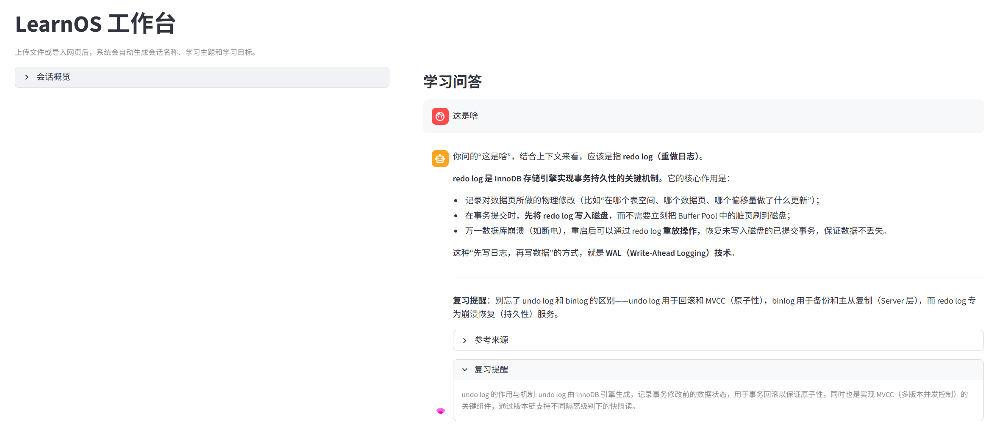
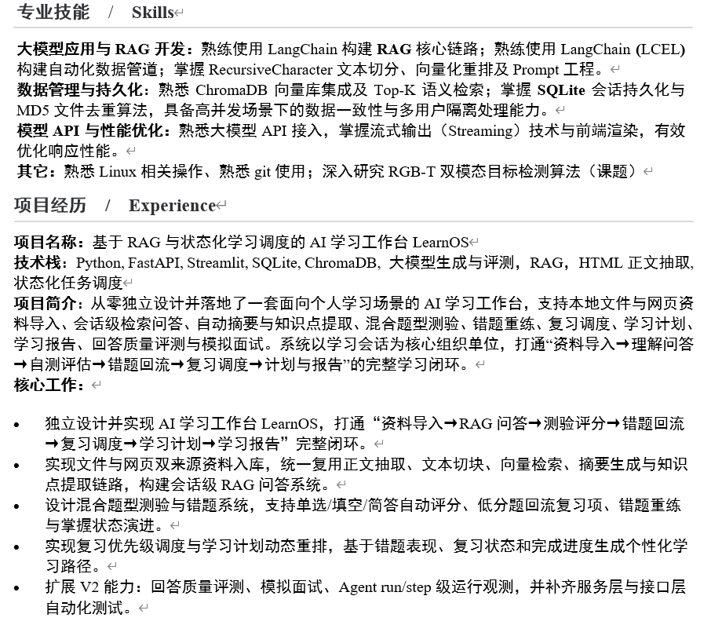

# 希望实现网页学习资料导入（如：https://xiaolincoding.com/mysql/lock/how_to_lock.html），分析一下可行性

## Transcript

### User 1

<environment_context>
  <cwd>e:\files\vscode_file\agent\LearnOS</cwd>
  <shell>powershell</shell>
  <current_date>2026-04-22</current_date>
  <timezone>Asia/Shanghai</timezone>
</environment_context>

希望实现网页学习资料导入（如：https://xiaolincoding.com/mysql/lock/how_to_lock.html），分析一下可行性
13:54


已处理 2m 23s
可行性很高，而且很适合放进 LearnOS 作为一个亮点功能。以你给的这篇小林文章为例，网页本身是可以直接抓到正文的静态文章页，不是必须依赖前端 JS 才能渲染出来的那类页面；我查看到页面里既有明确标题和正文段落，也混有导航、目录、侧边栏、推广区块，所以关键不是“能不能抓”，而是“要不要做一层正文抽取”。来源页：https://xiaolincoding.com/mysql/lock/how_to_lock.html

从你现在的代码结构看，接入成本也不高。现有 LearnOS 已经有完整的“文本入库”流水线：Server.py 里 _ingest_documents_for_session 已经覆盖了文本读取、切块、向量入库、摘要、知识点和复习项生成；document_loader.py 现在只是把 pdf/docx/txt/md 转成纯文本。也就是说，网页导入本质上只需要补一个 URL -> 网页正文文本 的适配层，然后复用你现有的入库链路，不需要重写 RAG、摘要、复习系统。

我建议按这条路线做，最稳也最适合项目展示：

MVP
单页 URL 导入。前端加一个“网页链接导入”输入框，后端新增接口比如 POST /study_sessions/import_webpage。后端抓取 HTML，抽取 title + main content，转成纯文本后按“伪文档”走现有入库流程。

V1
站内批量导入。支持输入一个目录页或栏目页，自动抓取同站若干篇文章，形成一个学习会话。这一版很适合做“系列学习”。

V2
动态网页兼容。对必须 JS 渲染的页面增加 Playwright 兜底抓取，但这不建议作为第一步，因为复杂度会明显上升。

实现上我建议你这么落：

新增 WebPageLoader 或 URLLoader
职责是请求网页、清洗 HTML、提取正文、返回：
title
content
source_url
site_name
优先用正文抽取库
首选 trafilatura
备选 readability-lxml + BeautifulSoup
再不行就手写站点规则
文档表保留网页来源信息
file_type 可写成 url / html
metadata_json 里加 source_url、source_type=webpage、site_name
做去重
normalized_url
content_hash
这样同一网页重复导入时能识别
前端改动很小
现在上传区旁边再放一个 URL 输入框即可
风险点也有，但都可控：

正文抽取噪声
像小林这种页面同时带目录、侧栏、广告位、图片说明，不能直接整页转文本，否则摘要和知识点会被污染。
动态站点兼容性
知乎、掘金某些页面、登录后内容、懒加载内容会更麻烦。
版权与站点规则
技术上能抓，不代表适合大规模抓。建议先做“用户主动输入单页 URL 导入”，不要默认批量爬全站。
图片与代码块
网页里常有配图和代码块，第一版可以只保留代码文本和图片 alt/caption，不必先做图片 OCR。
结论上，这个功能非常值得做，原因是它和你的“自学 + 求职展示”目标很匹配：它能把 LearnOS 从“本地文件学习助手”升级成“多源学习资料操作系统”。如果你愿意，我下一步可以直接开始实现第一版，先支持“输入单个网页 URL，自动抽取正文并导入当前会话”。


13:57
实现第一版
14:02


我先核对一下你现在实际在用的是哪一份代码，再把“网页 URL 导入”接到现有上传入库链路上，尽量做成和文档导入同一套流程。


Ran 2 commands
代码主仓库确认还是 LearnOS，Muti_Agent 现在只剩文档镜像了。我接下来会直接在 LearnOS 里做第一版：单页 URL 导入到当前会话，后端抽正文，前端加入口。


Ran 3 commands
我准备把上传和网页导入统一到一套内部入库函数里，这样后面再加“批量网页导入”或“公众号/博客适配”时不会重复堆逻辑。前端会只加一个很轻的 URL 输入区，不会影响你现在的文档上传流程。


Ran 4 commands
我先补一个独立的网页抽取服务，再把后端接口和前端入口接上。这样这一版既能跑起来，也给后续做“站内批量导入”留了干净的扩展点。


已创建 1 个文件，已编辑 1 个文件
我在继续接后端，现在顺手把文档表的 source_type 一起接上，这样前端后面能区分“本地文件”和“网页资料”。刚才补的新网页抽取服务已经落地了。


已创建 1 个文件，已编辑 1 个文件，ran 4 commands
接下来的实现我会分四步落地：

后端新增网页正文抽取服务，先支持静态网页，优先提取 article/main 正文。
把“文本资源入库”抽成共享逻辑，让文件上传和网页导入都走同一条 RAG/摘要/复习链路。
前端侧边栏新增“网页链接导入”，支持“自动建会话”与“导入当前会话”两种用法。
做一轮语法检查，确认这一版至少在代码层面可启动。
我会尽量把改动收敛在 Server.py、Client.py、document_service.py 和新增的 webpage_service.py 里。

已运行 @' import hashlib import json import sqlite3 from pathlib import Path DB_PATH = Path(__file__).resolve().parent.parent / "study_agent.sqlite3" def _connect(): conn = sqlite3.connect(DB_PATH) conn.row_factory = sqlite3.Row return conn def calculate_content_hash(text: str) -> str: return hashlib.sha256(text.encode("utf-8")).hexdigest() def create_document( session_id: int, title: str, file_name: str, file_path: str, file_type: str, file_size: int, content_hash: str, source_type: str = "upload", metadata: dict | None = None, ): conn = _connect() cursor = conn.cursor() cursor.execute( """ INSERT INTO study_documents (session_id, title, file_name, file_path, file_type, file_size, content_hash, ingest_status, source_type, metadata_json) VALUES (?, ?, ?, ?, ?, ?, ?, 'processing', ?, ?) """, ( session_id, title, file_name, file_path, file_type, file_size, content_hash, source_type, json.dumps(metadata or {}, ensure_ascii=False), ), ) document_id = cursor.lastrowid conn.commit() conn.close() return document_id def mark_document_ingested(document_id: int, status: str = "completed"): conn = _connect() cursor = conn.cursor() cursor.execute( """ UPDATE study_documents SET ingest_status = ?, updated_at = CURRENT_TIMESTAMP WHERE id = ? """, (status, document_id), ) conn.commit() conn.close() def save_document_chunks(document_id: int, chunks: list[str], chroma_ids: list[str], base_metadata: dict): conn = _connect() cursor = conn.cursor() for index, chunk in enumerate(chunks): cursor.execute( """ INSERT INTO document_chunks (document_id, chunk_index, chunk_text, token_count, chroma_doc_id, metadata_json) VALUES (?, ?, ?, ?, ?, ?) """, ( document_id, index, chunk, len(chunk), chroma_ids[index], json.dumps(base_metadata, ensure_ascii=False), ), ) conn.commit() conn.close() def save_document_summary(document_id: int, summary_type: str, summary_text: str, extra: dict | None = None): conn = _connect() cursor = conn.cursor() cursor.execute( """ INSERT INTO document_summaries (document_id, summary_type, summary_text, extra_json) VALUES (?, ?, ?, ?) """, (document_id, summary_type, summary_text, json.dumps(extra or {}, ensure_ascii=False)), ) conn.commit() conn.close() def save_knowledge_points(session_id: int, document_id: int, knowledge_points: list[dict]): conn = _connect() cursor = conn.cursor() created_ids = [] for item in knowledge_points: cursor.execute( """ INSERT INTO knowledge_points (session_id, document_id, title, description, category, importance, difficulty, metadata_json) VALUES (?, ?, ?, ?, ?, ?, ?, ?) """, ( session_id, document_id, item.get("title", "Untitled knowledge point"), item.get("description", ""), item.get("category", "general"), item.get("importance", 3), item.get("difficulty", 3), json.dumps(item.get("metadata", {}), ensure_ascii=False), ), ) created_ids.append(cursor.lastrowid) conn.commit() conn.close() return created_ids def get_session_documents(session_id: int): conn = _connect() cursor = conn.cursor() cursor.execute( """ SELECT * FROM study_documents WHERE session_id = ? ORDER BY created_at ASC """, (session_id,), ) rows = [dict(row) for row in cursor.fetchall()] conn.close() return rows def get_session_summaries(session_id: int): conn = _connect() cursor = conn.cursor() cursor.execute( """ SELECT ds.*, sd.title AS document_title FROM document_summaries ds JOIN study_documents sd ON ds.document_id = sd.id WHERE sd.session_id = ? ORDER BY ds.created_at ASC """, (session_id,), ) rows = [dict(row) for row in cursor.fetchall()] conn.close() return rows def get_session_knowledge_points(session_id: int): conn = _connect() cursor = conn.cursor() cursor.execute( """ SELECT * FROM knowledge_points WHERE session_id = ? ORDER BY created_at ASC """, (session_id,), ) rows = [dict(row) for row in cursor.fetchall()] conn.close() return rows '@ | Set-Content -LiteralPath 'E:\files\vscode_file\agent\LearnOS\services\document_service.py' -Encoding utf8 @' # Server.py import json import os import sys from contextlib import asynccontextmanager from pathlib import Path import uvicorn from fastapi import FastAPI, File, Form, HTTPException, Query, UploadFile from fastapi.responses import StreamingResponse from pydantic import BaseModel ROOT_DIR = Path(__file__).resolve().parent.parent if str(ROOT_DIR) not in sys.path: sys.path.append(str(ROOT_DIR)) import config from RAG.document_loader import DocumentLoader from RAG.hybrid_retriever import HybridRetriever from RAG.text_splitter import SemanticTextSplitter from RAG.vector_store import ChromaDBStore from agent_engine import run_agent_cycle from chat_history_service import get_user_history, init_db, load_thread_state, save_chat_history from llm_generator import LLMGenerator from services.document_service import ( calculate_content_hash, create_document, get_session_documents, get_session_knowledge_points, get_session_summaries, mark_document_ingested, save_document_chunks, save_document_summary, save_knowledge_points, ) from services.review_service import build_review_context, create_review_items_from_knowledge_points, get_review_items_for_session from services.study_session_service import create_study_session, get_study_session, list_study_sessions, update_study_session from services.summary_service import infer_session_metadata, summarize_text from services.webpage_service import fetch_webpage_content from tools.init_db import init_study_db UPLOAD_DIR = Path(config.upload_directory) UPLOAD_DIR.mkdir(parents=True, exist_ok=True) @asynccontextmanager async def lifespan(app: FastAPI): init_db() init_study_db() yield app = FastAPI(title="LearnOS API", lifespan=lifespan) vector_store = ChromaDBStore() llm_generator = LLMGenerator( model_name=config.chat_model, api_key=os.getenv("DASHSCOPE_API_KEY"), base_url=os.getenv("BASE_URL", "https://dashscope.aliyuncs.com/compatible-mode/v1"), ) class SessionCreateRequest(BaseModel): user_id: str session_name: str topic: str = "" goal: str = "" tags: list[str] = [] class ChatRequest(BaseModel): user_id: str = "default_user" session_id: int | None = None query: str class WebpageImportRequest(BaseModel): user_id: str url: str def _ingest_text_resource( session_id: int, user_id: str, *, title: str, file_name: str, file_path: str, file_type: str, file_size: int, text: str, source_type: str, metadata: dict | None = None, ): normalized_text = text.strip() if not normalized_text: raise HTTPException(status_code=400, detail=f"Resource {title} does not contain readable text.") content_hash = calculate_content_hash(normalized_text) document_id = create_document( session_id=session_id, title=title, file_name=file_name, file_path=file_path, file_type=file_type, file_size=file_size, content_hash=content_hash, source_type=source_type, metadata=metadata, ) splitter = SemanticTextSplitter(chunk_size=config.chunk_size, chunk_overlap=config.chunk_overlap) chunks = splitter.split_text(normalized_text) if not chunks: chunks = [normalized_text] source_reference = (metadata or {}).get("source_url") or (metadata or {}).get("source") or file_path metadatas = [] ids = [] for chunk_index, _ in enumerate(chunks): metadatas.append( { "source": source_reference, "document_id": str(document_id), "document_title": title, "session_id": str(session_id), "chunk_index": chunk_index, "source_type": source_type, } ) ids.append(f"session_{session_id}_doc_{document_id}_chunk_{chunk_index}") vector_store.add_documents(documents=chunks, metadatas=metadatas, ids=ids) save_document_chunks( document_id=document_id, chunks=chunks, chroma_ids=ids, base_metadata={ "session_id": session_id, "source": source_reference, "source_type": source_type, }, ) summary_bundle = summarize_text(normalized_text, llm_generator=llm_generator) save_document_summary(document_id, "short_summary", summary_bundle["short_summary"]) save_document_summary(document_id, "keywords", ", ".join(summary_bundle["keywords"])) save_document_summary(document_id, "interview_takeaways", "\n".join(summary_bundle["interview_takeaways"])) knowledge_point_ids = save_knowledge_points(session_id, document_id, summary_bundle["knowledge_points"]) create_review_items_from_knowledge_points( user_id=user_id, session_id=session_id, knowledge_points=summary_bundle["knowledge_points"], knowledge_point_ids=knowledge_point_ids, ) mark_document_ingested(document_id=document_id, status="completed") return { "document_id": document_id, "title": title, "file_name": file_name, "source_type": source_type, "summary": summary_bundle["short_summary"], "knowledge_points": summary_bundle["knowledge_points"], }, file_name, normalized_text[:5000] def _refresh_session_metadata(session_id: int, file_names: list[str], merged_text_parts: list[str]): all_summaries = get_session_summaries(session_id) overall_summary = { "short_summary": "\n".join( [item["summary_text"] for item in all_summaries if item["summary_type"] == "short_summary"][:3] ), "keywords": [], } for item in all_summaries: if item["summary_type"] == "keywords": overall_summary["keywords"].extend([part.strip() for part in item["summary_text"].split(",") if part.strip()]) metadata = infer_session_metadata( file_names=file_names, merged_text="\n\n".join(merged_text_parts), summary_bundle=overall_summary, llm_generator=llm_generator, ) return update_study_session( session_id=session_id, session_name=metadata["session_name"], topic=metadata["topic"], goal=metadata["goal"], tags=metadata.get("tags", []), ) async def _ingest_documents_for_session(session_id: int, user_id: str, files: list[UploadFile]): session = get_study_session(session_id) if not session: raise HTTPException(status_code=404, detail="Study session not found.") session_dir = UPLOAD_DIR / f"session_{session_id}" session_dir.mkdir(parents=True, exist_ok=True) created_documents = [] file_names = [] merged_text_parts = [] for upload in files: file_path = session_dir / upload.filename file_bytes = await upload.read() file_path.write_bytes(file_bytes) try: loader = DocumentLoader(str(file_path)) text = loader.load().strip() except Exception as exc: raise HTTPException(status_code=400, detail=f"Failed to read {upload.filename}: {exc}") created_document, display_name, preview_text = _ingest_text_resource( session_id=session_id, user_id=user_id, title=Path(upload.filename).stem, file_name=upload.filename, file_path=str(file_path), file_type=file_path.suffix.lower(), file_size=len(file_bytes), text=text, source_type="upload", metadata={"source": str(file_path)}, ) created_documents.append(created_document) file_names.append(display_name) merged_text_parts.append(preview_text) updated_session = _refresh_session_metadata(session_id, file_names, merged_text_parts) return {"session": updated_session, "documents": created_documents} def _ingest_webpage_for_session(session_id: int, user_id: str, url: str): session = get_study_session(session_id) if not session: raise HTTPException(status_code=404, detail="Study session not found.") try: webpage = fetch_webpage_content(url) except requests.HTTPError as exc: status_code = exc.response.status_code if exc.response is not None else 502 raise HTTPException(status_code=status_code, detail=f"Failed to fetch webpage: {exc}") except Exception as exc: raise HTTPException(status_code=400, detail=f"Failed to import webpage: {exc}") created_document, display_name, preview_text = _ingest_text_resource( session_id=session_id, user_id=user_id, title=webpage["title"], file_name=webpage["source_url"], file_path=webpage["source_url"], file_type="url", file_size=len(webpage["text"].encode("utf-8")), text=webpage["text"], source_type="webpage", metadata={ "source": webpage["source_url"], "source_url": webpage["source_url"], "site_name": webpage["site_name"], }, ) updated_session = _refresh_session_metadata(session_id, [display_name], [preview_text]) return {"session": updated_session, "documents": [created_document], "webpage": webpage} def _build_session_retriever(session_id: int): where = {"session_id": str(session_id)} doc_chunks = vector_store.get_all_documents(where=where) if not doc_chunks: return None, [] retriever = HybridRetriever( vector_store=vector_store, doc_chunks=doc_chunks, vector_top_k=5, bm25_top_k=5, final_top_k=3, vector_where=where, ) return retriever, doc_chunks def _format_sources(retrieved_results: list[dict]) -> list[dict]: sources = [] for item in retrieved_results: metadata = item.get("metadata") or {} sources.append( { "score": item.get("score", 0.0), "source": metadata.get("source", "unknown"), "document_title": metadata.get("document_title", ""), "chunk_index": metadata.get("chunk_index"), } ) return sources def _build_extra_system_context(review_text: str) -> str: if not review_text: return "" return ( "After answering the learner's main question, add a short review reminder only if it helps. " "Keep the review section brief and clearly separated from the main answer.\n" f"{review_text}" ) @app.post("/study_sessions") async def create_session_endpoint(request: SessionCreateRequest): session = create_study_session( user_id=request.user_id, session_name=request.session_name, topic=request.topic, goal=request.goal, tags=request.tags, ) return {"session": session} @app.get("/study_sessions") async def list_sessions_endpoint(user_id: str = Query(...)): return {"sessions": list_study_sessions(user_id)} @app.get("/study_sessions/{session_id}") async def get_session_detail_endpoint(session_id: int): session = get_study_session(session_id) if not session: raise HTTPException(status_code=404, detail="Study session not found.") return { "session": session, "documents": get_session_documents(session_id), "summaries": get_session_summaries(session_id), "knowledge_points": get_session_knowledge_points(session_id), "review_items": get_review_items_for_session(session_id), } @app.post("/study_sessions/{session_id}/documents") async def upload_documents_endpoint( session_id: int, user_id: str = Form(...), files: list[UploadFile] = File(...), ): result = await _ingest_documents_for_session(session_id=session_id, user_id=user_id, files=files) return {"session_id": session_id, "session": result["session"], "documents": result["documents"]} @app.post("/study_sessions/auto_from_documents") async def auto_create_session_from_documents_endpoint( user_id: str = Form(...), files: list[UploadFile] = File(...), ): placeholder_session = create_study_session( user_id=user_id, session_name="资料整理中", topic="待分析", goal="等待系统根据上传资料自动生成学习信息。", tags=[], ) result = await _ingest_documents_for_session( session_id=placeholder_session["id"], user_id=user_id, files=files, ) return { "session_id": placeholder_session["id"], "session": result["session"], "documents": result["documents"], } @app.post("/study_sessions/{session_id}/webpages") async def import_webpage_endpoint(session_id: int, request: WebpageImportRequest): result = _ingest_webpage_for_session(session_id=session_id, user_id=request.user_id, url=request.url) return {"session_id": session_id, "session": result["session"], "documents": result["documents"]} @app.post("/study_sessions/auto_from_webpage") async def auto_create_session_from_webpage_endpoint(request: WebpageImportRequest): placeholder_session = create_study_session( user_id=request.user_id, session_name="网页资料整理中", topic="待分析", goal="等待系统根据网页内容自动生成学习信息。", tags=[], ) result = _ingest_webpage_for_session( session_id=placeholder_session["id"], user_id=request.user_id, url=request.url, ) return { "session_id": placeholder_session["id"], "session": result["session"], "documents": result["documents"], } @app.post("/agent_chat") async def agent_chat_endpoint(request: ChatRequest): try: thread_id = f"thread_{request.user_id}_{request.session_id or 'general'}" state = load_thread_state(thread_id) if request.session_id is not None: retriever, _ = _build_session_retriever(request.session_id) if retriever: retrieved_results = retriever.retrieve(request.query) state.user_info["rag_context"] = "\n".join( [f"- {item['metadata'].get('source', 'unknown')}: {item['document']}" for item in retrieved_results] ) review_context = build_review_context(request.user_id, request.query, current_session_id=request.session_id, limit=2) state.user_info["review_context"] = review_context["text"] def generate_sse(): for chunk in run_agent_cycle(request.query, state, llm_generator): yield json.dumps({"chunk": chunk}, ensure_ascii=False) + "\n" return StreamingResponse(generate_sse(), media_type="application/x-ndjson") except Exception as exc: raise HTTPException(status_code=500, detail=str(exc)) @app.post("/chat") async def chat_endpoint(request: ChatRequest): if request.session_id is None: raise HTTPException(status_code=400, detail="session_id is required for study chat.") retriever, doc_chunks = _build_session_retriever(request.session_id) if not retriever or not doc_chunks: raise HTTPException(status_code=400, detail="No indexed study materials were found for this session.") try: retrieved_results = retriever.retrieve(request.query) sources = _format_sources(retrieved_results) raw_history = get_user_history(request.user_id, session_id=request.session_id)[-6:] chat_history = [] for item in raw_history: chat_history.append({"role": "user", "content": item["query"]}) chat_history.append({"role": "assistant", "content": item["response"]}) review_context = build_review_context( user_id=request.user_id, query=request.query, current_session_id=request.session_id, limit=2, ) extra_system_context = _build_extra_system_context(review_context["text"]) def generate_stream(): full_response = "" try: for chunk in llm_generator.generate_answer_stream( request.query, retrieved_results, history=chat_history, extra_system_context=extra_system_context, ): full_response += chunk yield json.dumps({"chunk": chunk}, ensure_ascii=False) + "\n" yield json.dumps({"sources": sources, "review_items": review_context["items"]}, ensure_ascii=False) + "\n" save_chat_history( request.user_id, request.query, full_response, session_id=request.session_id, sources=sources, ) except Exception as inner_exc: error_msg = f"\n\n[backend streaming error: {inner_exc}]" yield json.dumps({"chunk": error_msg}, ensure_ascii=False) + "\n" return StreamingResponse(generate_stream(), media_type="application/x-ndjson") except Exception as exc: raise HTTPException(status_code=500, detail=str(exc)) @app.get("/history/{user_id}") async def get_history_endpoint(user_id: str, session_id: int | None = None): history_data = get_user_history(user_id, session_id=session_id) return {"user_id": user_id, "session_id": session_id, "history": history_data} if __name__ == "__main__": uvicorn.run(app, host="127.0.0.1", port=8000) '@ | Set-Content -LiteralPath 'E:\files\vscode_file\agent\LearnOS\Zero_RAG\Server.py' -Encoding utf8 @' import json import mimetypes import uuid import requests import streamlit as st API_BASE_URL = "http://127.0.0.1:8000" SUMMARY_TYPE_LABELS = { "short_summary": "简要摘要", "keywords": "关键词", "interview_takeaways": "面试要点", } SOURCE_TYPE_LABELS = { "upload": "文件", "webpage": "网页", } def get_query_param(name: str, default=None): value = st.query_params.get(name, default) if isinstance(value, list): return value[0] if value else default return value def set_query_param(name: str, value): if value is None: try: del st.query_params[name] except Exception: pass return st.query_params[name] = str(value) def ensure_user_id() -> str: existing_user_id = get_query_param("user_id") if existing_user_id: return existing_user_id new_user_id = str(uuid.uuid4()) set_query_param("user_id", new_user_id) return new_user_id def extract_error_message(response: requests.Response) -> str: try: payload = response.json() except Exception: return response.text or "请求失败。" return payload.get("detail") or payload.get("message") or response.text or "请求失败。" def refresh_sessions(): response = requests.get( f"{API_BASE_URL}/study_sessions", params={"user_id": st.session_state["user_id"]}, timeout=20, ) response.raise_for_status() return response.json().get("sessions", []) def load_session_detail(session_id: int): response = requests.get(f"{API_BASE_URL}/study_sessions/{session_id}", timeout=20) response.raise_for_status() st.session_state["session_detail"] = response.json() def summary_type_label(summary_type: str) -> str: return SUMMARY_TYPE_LABELS.get(summary_type, summary_type) def parse_metadata(metadata_json: str | None) -> dict: if not metadata_json: return {} try: return json.loads(metadata_json) except Exception: return {} def select_session(session_id: int): st.session_state["selected_session_id"] = session_id st.session_state["messages"] = [] set_query_param("session_id", session_id) load_session_detail(session_id) def build_file_payload(uploaded_files): files_payload = [] for file in uploaded_files: mime_type = mimetypes.guess_type(file.name)[0] or "application/octet-stream" files_payload.append(("files", (file.name, file.getvalue(), mime_type))) return files_payload def import_uploaded_files(auto_create: bool, uploaded_files): files_payload = build_file_payload(uploaded_files) if auto_create: response = requests.post( f"{API_BASE_URL}/study_sessions/auto_from_documents", data={"user_id": st.session_state["user_id"]}, files=files_payload, timeout=180, ) if response.ok: created = response.json()["session"] select_session(created["id"]) st.success("已根据上传资料自动创建学习会话。") else: st.error(extract_error_message(response)) return response = requests.post( f"{API_BASE_URL}/study_sessions/{st.session_state['selected_session_id']}/documents", data={"user_id": st.session_state["user_id"]}, files=files_payload, timeout=180, ) if response.ok: load_session_detail(st.session_state["selected_session_id"]) st.success("学习资料已导入，系统已同步更新会话信息。") else: st.error(extract_error_message(response)) def import_webpage(url: str, auto_create: bool): payload = { "user_id": st.session_state["user_id"], "url": url.strip(), } if auto_create: response = requests.post( f"{API_BASE_URL}/study_sessions/auto_from_webpage", json=payload, timeout=180, ) if response.ok: created = response.json()["session"] select_session(created["id"]) st.session_state["webpage_url_input"] = "" st.success("已根据网页内容自动创建学习会话。") else: st.error(extract_error_message(response)) return response = requests.post( f"{API_BASE_URL}/study_sessions/{st.session_state['selected_session_id']}/webpages", json=payload, timeout=180, ) if response.ok: load_session_detail(st.session_state["selected_session_id"]) st.session_state["webpage_url_input"] = "" st.success("网页资料已导入当前会话。") else: st.error(extract_error_message(response)) st.set_page_config(page_title="LearnOS", layout="wide") st.title("LearnOS 工作台") st.caption("上传文件或导入网页后，系统会自动生成会话名称、学习主题和学习目标。") if "messages" not in st.session_state: st.session_state["messages"] = [] if "user_id" not in st.session_state: st.session_state["user_id"] = ensure_user_id() if "selected_session_id" not in st.session_state: session_id_from_query = get_query_param("session_id") st.session_state["selected_session_id"] = int(session_id_from_query) if session_id_from_query else None if "session_detail" not in st.session_state: st.session_state["session_detail"] = None if "webpage_url_input" not in st.session_state: st.session_state["webpage_url_input"] = "" with st.sidebar: st.subheader("学习会话") try: sessions = refresh_sessions() except Exception as exc: sessions = [] st.error(f"加载学习会话失败：{exc}") if sessions: options = {f"{item['session_name']} (#{item['id']})": item["id"] for item in sessions} default_label = next( (label for label, value in options.items() if value == st.session_state["selected_session_id"]), None, ) labels = list(options.keys()) selected_label = st.selectbox( "选择学习会话", options=labels, index=labels.index(default_label) if default_label in labels else 0, ) selected_session_id = options[selected_label] if selected_session_id != st.session_state["selected_session_id"]: select_session(selected_session_id) elif st.session_state["session_detail"] is None: set_query_param("session_id", selected_session_id) load_session_detail(selected_session_id) else: st.caption("当前还没有学习会话，导入资料后会自动创建。") set_query_param("session_id", None) st.markdown("### 文件导入") uploaded_files = st.file_uploader( "上传学习资料", type=["pdf", "docx", "txt", "md"], accept_multiple_files=True, ) if st.session_state["selected_session_id"] is None: if st.button("根据上传资料自动创建会话", disabled=not uploaded_files, use_container_width=True): import_uploaded_files(auto_create=True, uploaded_files=uploaded_files) else: if st.button("向当前会话继续导入资料", disabled=not uploaded_files, use_container_width=True): import_uploaded_files(auto_create=False, uploaded_files=uploaded_files) st.markdown("### 网页导入") webpage_url = st.text_input( "学习网页链接", key="webpage_url_input", placeholder="例如：https://xiaolincoding.com/mysql/lock/how_to_lock.html", ) if st.session_state["selected_session_id"] is None: if st.button("根据网页内容自动创建会话", disabled=not webpage_url.strip(), use_container_width=True): import_webpage(webpage_url, auto_create=True) else: if st.button("导入当前网页到当前会话", disabled=not webpage_url.strip(), use_container_width=True): import_webpage(webpage_url, auto_create=False) st.caption(f"当前用户标识：{st.session_state['user_id']}") detail = st.session_state.get("session_detail") left_col, right_col = st.columns([1.1, 1.4]) with left_col: st.subheader("会话概览") if detail: session = detail["session"] st.markdown(f"**会话名称：** {session['session_name']}") if session.get("topic"): st.markdown(f"**学习主题：** {session['topic']}") if session.get("goal"): st.markdown(f"**学习目标：** {session['goal']}") documents = detail.get("documents", []) summaries = detail.get("summaries", []) knowledge_points = detail.get("knowledge_points", []) review_items = detail.get("review_items", []) with st.expander("文档列表", expanded=True): if documents: for document in documents: source_type = SOURCE_TYPE_LABELS.get(document.get("source_type"), document.get("source_type") or "未知") st.write(f"- {document['title']}（{source_type}）") metadata = parse_metadata(document.get("metadata_json")) if document.get("source_type") == "webpage": source_url = metadata.get("source_url") or document.get("file_path") if source_url: st.caption(source_url) else: st.caption("当前还没有导入资料。") with st.expander("摘要信息", expanded=True): if summaries: for item in summaries: st.markdown(f"**{summary_type_label(item['summary_type'])}**") st.write(item["summary_text"]) else: st.caption("当前还没有摘要。") with st.expander("知识点", expanded=True): if knowledge_points: for point in knowledge_points: st.markdown(f"**{point['title']}**") st.caption(point["description"]) else: st.caption("当前还没有知识点。") with st.expander("复习项", expanded=False): if review_items: for item in review_items: st.markdown(f"**{item['topic']}**") st.caption(item["summary"]) else: st.caption("当前还没有复习项。") else: st.info("请先上传学习资料或导入网页，系统会自动创建会话。") with right_col: st.subheader("学习问答") for message in st.session_state["messages"]: with st.chat_message(message["role"]): st.write(message["content"]) if message.get("sources"): with st.expander("参考来源"): for source in message["sources"]: st.caption( f"{source.get('document_title') or source['source']} | " f"分数={source.get('score', 0):.4f} | 分片={source.get('chunk_index')}" ) if message.get("review_items"): with st.expander("复习提醒"): for item in message["review_items"]: st.caption(f"{item['topic']}: {item['summary']}") user_query = st.chat_input( "围绕今天的学习资料提问...", disabled=st.session_state["selected_session_id"] is None, ) if user_query and st.session_state["selected_session_id"] is not None: st.session_state["messages"].append({"role": "user", "content": user_query}) with st.chat_message("user"): st.write(user_query) with st.chat_message("assistant"): try: payload = { "user_id": st.session_state["user_id"], "session_id": st.session_state["selected_session_id"], "query": user_query, } response = requests.post(f"{API_BASE_URL}/chat", json=payload, stream=True, timeout=120) response.raise_for_status() answer_placeholder = st.empty() full_answer = "" sources = [] review_items = [] for line in response.iter_lines(): if line: data = json.loads(line.decode("utf-8")) if "chunk" in data: full_answer += data["chunk"] answer_placeholder.markdown(full_answer + "▌") if "sources" in data: sources = data["sources"] if "review_items" in data: review_items = data["review_items"] answer_placeholder.markdown(full_answer) if sources: with st.expander("参考来源"): for source in sources: st.caption( f"{source.get('document_title') or source['source']} | " f"分数={source.get('score', 0):.4f} | 分片={source.get('chunk_index')}" ) if review_items: with st.expander("复习提醒"): for item in review_items: st.caption(f"{item['topic']}: {item['summary']}") st.session_state["messages"].append( { "role": "assistant", "content": full_answer, "sources": sources, "review_items": review_items, } ) except Exception as exc: st.error(f"请求失败：{exc}") '@ | Set-Content -LiteralPath 'E:\files\vscode_file\agent\LearnOS\Zero_RAG\Client.py' -Encoding utf8
当前卡点不是实现本身，而是这个会话的写权限只覆盖旧的 Muti_Agent 目录，LearnOS 需要单独提权写入。我现在改成分文件提交，先把后端关键文件写进去，避免一次性脚本太长。

已运行 @' import hashlib import json import sqlite3 from pathlib import Path DB_PATH = Path(__file__).resolve().parent.parent / "study_agent.sqlite3" def _connect(): conn = sqlite3.connect(DB_PATH) conn.row_factory = sqlite3.Row return conn def calculate_content_hash(text: str) -> str: return hashlib.sha256(text.encode("utf-8")).hexdigest() def create_document( session_id: int, title: str, file_name: str, file_path: str, file_type: str, file_size: int, content_hash: str, source_type: str = "upload", metadata: dict | None = None, ): conn = _connect() cursor = conn.cursor() cursor.execute( """ INSERT INTO study_documents (session_id, title, file_name, file_path, file_type, file_size, content_hash, ingest_status, source_type, metadata_json) VALUES (?, ?, ?, ?, ?, ?, ?, 'processing', ?, ?) """, ( session_id, title, file_name, file_path, file_type, file_size, content_hash, source_type, json.dumps(metadata or {}, ensure_ascii=False), ), ) document_id = cursor.lastrowid conn.commit() conn.close() return document_id def mark_document_ingested(document_id: int, status: str = "completed"): conn = _connect() cursor = conn.cursor() cursor.execute( """ UPDATE study_documents SET ingest_status = ?, updated_at = CURRENT_TIMESTAMP WHERE id = ? """, (status, document_id), ) conn.commit() conn.close() def save_document_chunks(document_id: int, chunks: list[str], chroma_ids: list[str], base_metadata: dict): conn = _connect() cursor = conn.cursor() for index, chunk in enumerate(chunks): cursor.execute( """ INSERT INTO document_chunks (document_id, chunk_index, chunk_text, token_count, chroma_doc_id, metadata_json) VALUES (?, ?, ?, ?, ?, ?) """, ( document_id, index, chunk, len(chunk), chroma_ids[index], json.dumps(base_metadata, ensure_ascii=False), ), ) conn.commit() conn.close() def save_document_summary(document_id: int, summary_type: str, summary_text: str, extra: dict | None = None): conn = _connect() cursor = conn.cursor() cursor.execute( """ INSERT INTO document_summaries (document_id, summary_type, summary_text, extra_json) VALUES (?, ?, ?, ?) """, (document_id, summary_type, summary_text, json.dumps(extra or {}, ensure_ascii=False)), ) conn.commit() conn.close() def save_knowledge_points(session_id: int, document_id: int, knowledge_points: list[dict]): conn = _connect() cursor = conn.cursor() created_ids = [] for item in knowledge_points: cursor.execute( """ INSERT INTO knowledge_points (session_id, document_id, title, description, category, importance, difficulty, metadata_json) VALUES (?, ?, ?, ?, ?, ?, ?, ?) """, ( session_id, document_id, item.get("title", "Untitled knowledge point"), item.get("description", ""), item.get("category", "general"), item.get("importance", 3), item.get("difficulty", 3), json.dumps(item.get("metadata", {}), ensure_ascii=False), ), ) created_ids.append(cursor.lastrowid) conn.commit() conn.close() return created_ids def get_session_documents(session_id: int): conn = _connect() cursor = conn.cursor() cursor.execute( """ SELECT * FROM study_documents WHERE session_id = ? ORDER BY created_at ASC """, (session_id,), ) rows = [dict(row) for row in cursor.fetchall()] conn.close() return rows def get_session_summaries(session_id: int): conn = _connect() cursor = conn.cursor() cursor.execute( """ SELECT ds.*, sd.title AS document_title FROM document_summaries ds JOIN study_documents sd ON ds.document_id = sd.id WHERE sd.session_id = ? ORDER BY ds.created_at ASC """, (session_id,), ) rows = [dict(row) for row in cursor.fetchall()] conn.close() return rows def get_session_knowledge_points(session_id: int): conn = _connect() cursor = conn.cursor() cursor.execute( """ SELECT * FROM knowledge_points WHERE session_id = ? ORDER BY created_at ASC """, (session_id,), ) rows = [dict(row) for row in cursor.fetchall()] conn.close() return rows '@ | Set-Content -LiteralPath 'E:\files\vscode_file\agent\LearnOS\services\document_service.py' -Encoding utf8
后端文档服务已经写进去了。接下来我用一个更稳的办法把 Server.py 和 Client.py 先落到临时文件，再复制进 LearnOS，这样能避开 Windows 命令长度限制。

### User 2

希望实现网页学习资料导入（如：https://xiaolincoding.com/mysql/lock/how_to_lock.html），分析一下可行性
13:54


已处理 2m 23s
可行性很高，而且很适合放进 LearnOS 作为一个亮点功能。以你给的这篇小林文章为例，网页本身是可以直接抓到正文的静态文章页，不是必须依赖前端 JS 才能渲染出来的那类页面；我查看到页面里既有明确标题和正文段落，也混有导航、目录、侧边栏、推广区块，所以关键不是“能不能抓”，而是“要不要做一层正文抽取”。来源页：https://xiaolincoding.com/mysql/lock/how_to_lock.html

从你现在的代码结构看，接入成本也不高。现有 LearnOS 已经有完整的“文本入库”流水线：Server.py 里 _ingest_documents_for_session 已经覆盖了文本读取、切块、向量入库、摘要、知识点和复习项生成；document_loader.py 现在只是把 pdf/docx/txt/md 转成纯文本。也就是说，网页导入本质上只需要补一个 URL -> 网页正文文本 的适配层，然后复用你现有的入库链路，不需要重写 RAG、摘要、复习系统。

我建议按这条路线做，最稳也最适合项目展示：

MVP
单页 URL 导入。前端加一个“网页链接导入”输入框，后端新增接口比如 POST /study_sessions/import_webpage。后端抓取 HTML，抽取 title + main content，转成纯文本后按“伪文档”走现有入库流程。

V1
站内批量导入。支持输入一个目录页或栏目页，自动抓取同站若干篇文章，形成一个学习会话。这一版很适合做“系列学习”。

V2
动态网页兼容。对必须 JS 渲染的页面增加 Playwright 兜底抓取，但这不建议作为第一步，因为复杂度会明显上升。

实现上我建议你这么落：

新增 WebPageLoader 或 URLLoader
职责是请求网页、清洗 HTML、提取正文、返回：
title
content
source_url
site_name
优先用正文抽取库
首选 trafilatura
备选 readability-lxml + BeautifulSoup
再不行就手写站点规则
文档表保留网页来源信息
file_type 可写成 url / html
metadata_json 里加 source_url、source_type=webpage、site_name
做去重
normalized_url
content_hash
这样同一网页重复导入时能识别
前端改动很小
现在上传区旁边再放一个 URL 输入框即可
风险点也有，但都可控：

正文抽取噪声
像小林这种页面同时带目录、侧栏、广告位、图片说明，不能直接整页转文本，否则摘要和知识点会被污染。
动态站点兼容性
知乎、掘金某些页面、登录后内容、懒加载内容会更麻烦。
版权与站点规则
技术上能抓，不代表适合大规模抓。建议先做“用户主动输入单页 URL 导入”，不要默认批量爬全站。
图片与代码块
网页里常有配图和代码块，第一版可以只保留代码文本和图片 alt/caption，不必先做图片 OCR。
结论上，这个功能非常值得做，原因是它和你的“自学 + 求职展示”目标很匹配：它能把 LearnOS 从“本地文件学习助手”升级成“多源学习资料操作系统”。如果你愿意，我下一步可以直接开始实现第一版，先支持“输入单个网页 URL，自动抽取正文并导入当前会话”。


13:57
实现第一版
14:02


我先核对一下你现在实际在用的是哪一份代码，再把“网页 URL 导入”接到现有上传入库链路上，尽量做成和文档导入同一套流程。


Ran 2 commands
代码主仓库确认还是 LearnOS，Muti_Agent 现在只剩文档镜像了。我接下来会直接在 LearnOS 里做第一版：单页 URL 导入到当前会话，后端抽正文，前端加入口。


Ran 3 commands
我准备把上传和网页导入统一到一套内部入库函数里，这样后面再加“批量网页导入”或“公众号/博客适配”时不会重复堆逻辑。前端会只加一个很轻的 URL 输入区，不会影响你现在的文档上传流程。


Ran 4 commands
我先补一个独立的网页抽取服务，再把后端接口和前端入口接上。这样这一版既能跑起来，也给后续做“站内批量导入”留了干净的扩展点。


已创建 1 个文件，已编辑 1 个文件
我在继续接后端，现在顺手把文档表的 source_type 一起接上，这样前端后面能区分“本地文件”和“网页资料”。刚才补的新网页抽取服务已经落地了。


已创建 1 个文件，已编辑 1 个文件，ran 4 commands
接下来的实现我会分四步落地：

后端新增网页正文抽取服务，先支持静态网页，优先提取 article/main 正文。
把“文本资源入库”抽成共享逻辑，让文件上传和网页导入都走同一条 RAG/摘要/复习链路。
前端侧边栏新增“网页链接导入”，支持“自动建会话”与“导入当前会话”两种用法。
做一轮语法检查，确认这一版至少在代码层面可启动。
我会尽量把改动收敛在 Server.py、Client.py、document_service.py 和新增的 webpage_service.py 里。

已运行 @' import hashlib import json import sqlite3 from pathlib import Path DB_PATH = Path(__file__).resolve().parent.parent / "study_agent.sqlite3" def _connect(): conn = sqlite3.connect(DB_PATH) conn.row_factory = sqlite3.Row return conn def calculate_content_hash(text: str) -> str: return hashlib.sha256(text.encode("utf-8")).hexdigest() def create_document( session_id: int, title: str, file_name: str, file_path: str, file_type: str, file_size: int, content_hash: str, source_type: str = "upload", metadata: dict | None = None, ): conn = _connect() cursor = conn.cursor() cursor.execute( """ INSERT INTO study_documents (session_id, title, file_name, file_path, file_type, file_size, content_hash, ingest_status, source_type, metadata_json) VALUES (?, ?, ?, ?, ?, ?, ?, 'processing', ?, ?) """, ( session_id, title, file_name, file_path, file_type, file_size, content_hash, source_type, json.dumps(metadata or {}, ensure_ascii=False), ), ) document_id = cursor.lastrowid conn.commit() conn.close() return document_id def mark_document_ingested(document_id: int, status: str = "completed"): conn = _connect() cursor = conn.cursor() cursor.execute( """ UPDATE study_documents SET ingest_status = ?, updated_at = CURRENT_TIMESTAMP WHERE id = ? """, (status, document_id), ) conn.commit() conn.close() def save_document_chunks(document_id: int, chunks: list[str], chroma_ids: list[str], base_metadata: dict): conn = _connect() cursor = conn.cursor() for index, chunk in enumerate(chunks): cursor.execute( """ INSERT INTO document_chunks (document_id, chunk_index, chunk_text, token_count, chroma_doc_id, metadata_json) VALUES (?, ?, ?, ?, ?, ?) """, ( document_id, index, chunk, len(chunk), chroma_ids[index], json.dumps(base_metadata, ensure_ascii=False), ), ) conn.commit() conn.close() def save_document_summary(document_id: int, summary_type: str, summary_text: str, extra: dict | None = None): conn = _connect() cursor = conn.cursor() cursor.execute( """ INSERT INTO document_summaries (document_id, summary_type, summary_text, extra_json) VALUES (?, ?, ?, ?) """, (document_id, summary_type, summary_text, json.dumps(extra or {}, ensure_ascii=False)), ) conn.commit() conn.close() def save_knowledge_points(session_id: int, document_id: int, knowledge_points: list[dict]): conn = _connect() cursor = conn.cursor() created_ids = [] for item in knowledge_points: cursor.execute( """ INSERT INTO knowledge_points (session_id, document_id, title, description, category, importance, difficulty, metadata_json) VALUES (?, ?, ?, ?, ?, ?, ?, ?) """, ( session_id, document_id, item.get("title", "Untitled knowledge point"), item.get("description", ""), item.get("category", "general"), item.get("importance", 3), item.get("difficulty", 3), json.dumps(item.get("metadata", {}), ensure_ascii=False), ), ) created_ids.append(cursor.lastrowid) conn.commit() conn.close() return created_ids def get_session_documents(session_id: int): conn = _connect() cursor = conn.cursor() cursor.execute( """ SELECT * FROM study_documents WHERE session_id = ? ORDER BY created_at ASC """, (session_id,), ) rows = [dict(row) for row in cursor.fetchall()] conn.close() return rows def get_session_summaries(session_id: int): conn = _connect() cursor = conn.cursor() cursor.execute( """ SELECT ds.*, sd.title AS document_title FROM document_summaries ds JOIN study_documents sd ON ds.document_id = sd.id WHERE sd.session_id = ? ORDER BY ds.created_at ASC """, (session_id,), ) rows = [dict(row) for row in cursor.fetchall()] conn.close() return rows def get_session_knowledge_points(session_id: int): conn = _connect() cursor = conn.cursor() cursor.execute( """ SELECT * FROM knowledge_points WHERE session_id = ? ORDER BY created_at ASC """, (session_id,), ) rows = [dict(row) for row in cursor.fetchall()] conn.close() return rows '@ | Set-Content -LiteralPath 'E:\files\vscode_file\agent\LearnOS\services\document_service.py' -Encoding utf8 @' # Server.py import json import os import sys from contextlib import asynccontextmanager from pathlib import Path import uvicorn from fastapi import FastAPI, File, Form, HTTPException, Query, UploadFile from fastapi.responses import StreamingResponse from pydantic import BaseModel ROOT_DIR = Path(__file__).resolve().parent.parent if str(ROOT_DIR) not in sys.path: sys.path.append(str(ROOT_DIR)) import config from RAG.document_loader import DocumentLoader from RAG.hybrid_retriever import HybridRetriever from RAG.text_splitter import SemanticTextSplitter from RAG.vector_store import ChromaDBStore from agent_engine import run_agent_cycle from chat_history_service import get_user_history, init_db, load_thread_state, save_chat_history from llm_generator import LLMGenerator from services.document_service import ( calculate_content_hash, create_document, get_session_documents, get_session_knowledge_points, get_session_summaries, mark_document_ingested, save_document_chunks, save_document_summary, save_knowledge_points, ) from services.review_service import build_review_context, create_review_items_from_knowledge_points, get_review_items_for_session from services.study_session_service import create_study_session, get_study_session, list_study_sessions, update_study_session from services.summary_service import infer_session_metadata, summarize_text from services.webpage_service import fetch_webpage_content from tools.init_db import init_study_db UPLOAD_DIR = Path(config.upload_directory) UPLOAD_DIR.mkdir(parents=True, exist_ok=True) @asynccontextmanager async def lifespan(app: FastAPI): init_db() init_study_db() yield app = FastAPI(title="LearnOS API", lifespan=lifespan) vector_store = ChromaDBStore() llm_generator = LLMGenerator( model_name=config.chat_model, api_key=os.getenv("DASHSCOPE_API_KEY"), base_url=os.getenv("BASE_URL", "https://dashscope.aliyuncs.com/compatible-mode/v1"), ) class SessionCreateRequest(BaseModel): user_id: str session_name: str topic: str = "" goal: str = "" tags: list[str] = [] class ChatRequest(BaseModel): user_id: str = "default_user" session_id: int | None = None query: str class WebpageImportRequest(BaseModel): user_id: str url: str def _ingest_text_resource( session_id: int, user_id: str, *, title: str, file_name: str, file_path: str, file_type: str, file_size: int, text: str, source_type: str, metadata: dict | None = None, ): normalized_text = text.strip() if not normalized_text: raise HTTPException(status_code=400, detail=f"Resource {title} does not contain readable text.") content_hash = calculate_content_hash(normalized_text) document_id = create_document( session_id=session_id, title=title, file_name=file_name, file_path=file_path, file_type=file_type, file_size=file_size, content_hash=content_hash, source_type=source_type, metadata=metadata, ) splitter = SemanticTextSplitter(chunk_size=config.chunk_size, chunk_overlap=config.chunk_overlap) chunks = splitter.split_text(normalized_text) if not chunks: chunks = [normalized_text] source_reference = (metadata or {}).get("source_url") or (metadata or {}).get("source") or file_path metadatas = [] ids = [] for chunk_index, _ in enumerate(chunks): metadatas.append( { "source": source_reference, "document_id": str(document_id), "document_title": title, "session_id": str(session_id), "chunk_index": chunk_index, "source_type": source_type, } ) ids.append(f"session_{session_id}_doc_{document_id}_chunk_{chunk_index}") vector_store.add_documents(documents=chunks, metadatas=metadatas, ids=ids) save_document_chunks( document_id=document_id, chunks=chunks, chroma_ids=ids, base_metadata={ "session_id": session_id, "source": source_reference, "source_type": source_type, }, ) summary_bundle = summarize_text(normalized_text, llm_generator=llm_generator) save_document_summary(document_id, "short_summary", summary_bundle["short_summary"]) save_document_summary(document_id, "keywords", ", ".join(summary_bundle["keywords"])) save_document_summary(document_id, "interview_takeaways", "\n".join(summary_bundle["interview_takeaways"])) knowledge_point_ids = save_knowledge_points(session_id, document_id, summary_bundle["knowledge_points"]) create_review_items_from_knowledge_points( user_id=user_id, session_id=session_id, knowledge_points=summary_bundle["knowledge_points"], knowledge_point_ids=knowledge_point_ids, ) mark_document_ingested(document_id=document_id, status="completed") return { "document_id": document_id, "title": title, "file_name": file_name, "source_type": source_type, "summary": summary_bundle["short_summary"], "knowledge_points": summary_bundle["knowledge_points"], }, file_name, normalized_text[:5000] def _refresh_session_metadata(session_id: int, file_names: list[str], merged_text_parts: list[str]): all_summaries = get_session_summaries(session_id) overall_summary = { "short_summary": "\n".join( [item["summary_text"] for item in all_summaries if item["summary_type"] == "short_summary"][:3] ), "keywords": [], } for item in all_summaries: if item["summary_type"] == "keywords": overall_summary["keywords"].extend([part.strip() for part in item["summary_text"].split(",") if part.strip()]) metadata = infer_session_metadata( file_names=file_names, merged_text="\n\n".join(merged_text_parts), summary_bundle=overall_summary, llm_generator=llm_generator, ) return update_study_session( session_id=session_id, session_name=metadata["session_name"], topic=metadata["topic"], goal=metadata["goal"], tags=metadata.get("tags", []), ) async def _ingest_documents_for_session(session_id: int, user_id: str, files: list[UploadFile]): session = get_study_session(session_id) if not session: raise HTTPException(status_code=404, detail="Study session not found.") session_dir = UPLOAD_DIR / f"session_{session_id}" session_dir.mkdir(parents=True, exist_ok=True) created_documents = [] file_names = [] merged_text_parts = [] for upload in files: file_path = session_dir / upload.filename file_bytes = await upload.read() file_path.write_bytes(file_bytes) try: loader = DocumentLoader(str(file_path)) text = loader.load().strip() except Exception as exc: raise HTTPException(status_code=400, detail=f"Failed to read {upload.filename}: {exc}") created_document, display_name, preview_text = _ingest_text_resource( session_id=session_id, user_id=user_id, title=Path(upload.filename).stem, file_name=upload.filename, file_path=str(file_path), file_type=file_path.suffix.lower(), file_size=len(file_bytes), text=text, source_type="upload", metadata={"source": str(file_path)}, ) created_documents.append(created_document) file_names.append(display_name) merged_text_parts.append(preview_text) updated_session = _refresh_session_metadata(session_id, file_names, merged_text_parts) return {"session": updated_session, "documents": created_documents} def _ingest_webpage_for_session(session_id: int, user_id: str, url: str): session = get_study_session(session_id) if not session: raise HTTPException(status_code=404, detail="Study session not found.") try: webpage = fetch_webpage_content(url) except requests.HTTPError as exc: status_code = exc.response.status_code if exc.response is not None else 502 raise HTTPException(status_code=status_code, detail=f"Failed to fetch webpage: {exc}") except Exception as exc: raise HTTPException(status_code=400, detail=f"Failed to import webpage: {exc}") created_document, display_name, preview_text = _ingest_text_resource( session_id=session_id, user_id=user_id, title=webpage["title"], file_name=webpage["source_url"], file_path=webpage["source_url"], file_type="url", file_size=len(webpage["text"].encode("utf-8")), text=webpage["text"], source_type="webpage", metadata={ "source": webpage["source_url"], "source_url": webpage["source_url"], "site_name": webpage["site_name"], }, ) updated_session = _refresh_session_metadata(session_id, [display_name], [preview_text]) return {"session": updated_session, "documents": [created_document], "webpage": webpage} def _build_session_retriever(session_id: int): where = {"session_id": str(session_id)} doc_chunks = vector_store.get_all_documents(where=where) if not doc_chunks: return None, [] retriever = HybridRetriever( vector_store=vector_store, doc_chunks=doc_chunks, vector_top_k=5, bm25_top_k=5, final_top_k=3, vector_where=where, ) return retriever, doc_chunks def _format_sources(retrieved_results: list[dict]) -> list[dict]: sources = [] for item in retrieved_results: metadata = item.get("metadata") or {} sources.append( { "score": item.get("score", 0.0), "source": metadata.get("source", "unknown"), "document_title": metadata.get("document_title", ""), "chunk_index": metadata.get("chunk_index"), } ) return sources def _build_extra_system_context(review_text: str) -> str: if not review_text: return "" return ( "After answering the learner's main question, add a short review reminder only if it helps. " "Keep the review section brief and clearly separated from the main answer.\n" f"{review_text}" ) @app.post("/study_sessions") async def create_session_endpoint(request: SessionCreateRequest): session = create_study_session( user_id=request.user_id, session_name=request.session_name, topic=request.topic, goal=request.goal, tags=request.tags, ) return {"session": session} @app.get("/study_sessions") async def list_sessions_endpoint(user_id: str = Query(...)): return {"sessions": list_study_sessions(user_id)} @app.get("/study_sessions/{session_id}") async def get_session_detail_endpoint(session_id: int): session = get_study_session(session_id) if not session: raise HTTPException(status_code=404, detail="Study session not found.") return { "session": session, "documents": get_session_documents(session_id), "summaries": get_session_summaries(session_id), "knowledge_points": get_session_knowledge_points(session_id), "review_items": get_review_items_for_session(session_id), } @app.post("/study_sessions/{session_id}/documents") async def upload_documents_endpoint( session_id: int, user_id: str = Form(...), files: list[UploadFile] = File(...), ): result = await _ingest_documents_for_session(session_id=session_id, user_id=user_id, files=files) return {"session_id": session_id, "session": result["session"], "documents": result["documents"]} @app.post("/study_sessions/auto_from_documents") async def auto_create_session_from_documents_endpoint( user_id: str = Form(...), files: list[UploadFile] = File(...), ): placeholder_session = create_study_session( user_id=user_id, session_name="资料整理中", topic="待分析", goal="等待系统根据上传资料自动生成学习信息。", tags=[], ) result = await _ingest_documents_for_session( session_id=placeholder_session["id"], user_id=user_id, files=files, ) return { "session_id": placeholder_session["id"], "session": result["session"], "documents": result["documents"], } @app.post("/study_sessions/{session_id}/webpages") async def import_webpage_endpoint(session_id: int, request: WebpageImportRequest): result = _ingest_webpage_for_session(session_id=session_id, user_id=request.user_id, url=request.url) return {"session_id": session_id, "session": result["session"], "documents": result["documents"]} @app.post("/study_sessions/auto_from_webpage") async def auto_create_session_from_webpage_endpoint(request: WebpageImportRequest): placeholder_session = create_study_session( user_id=request.user_id, session_name="网页资料整理中", topic="待分析", goal="等待系统根据网页内容自动生成学习信息。", tags=[], ) result = _ingest_webpage_for_session( session_id=placeholder_session["id"], user_id=request.user_id, url=request.url, ) return { "session_id": placeholder_session["id"], "session": result["session"], "documents": result["documents"], } @app.post("/agent_chat") async def agent_chat_endpoint(request: ChatRequest): try: thread_id = f"thread_{request.user_id}_{request.session_id or 'general'}" state = load_thread_state(thread_id) if request.session_id is not None: retriever, _ = _build_session_retriever(request.session_id) if retriever: retrieved_results = retriever.retrieve(request.query) state.user_info["rag_context"] = "\n".join( [f"- {item['metadata'].get('source', 'unknown')}: {item['document']}" for item in retrieved_results] ) review_context = build_review_context(request.user_id, request.query, current_session_id=request.session_id, limit=2) state.user_info["review_context"] = review_context["text"] def generate_sse(): for chunk in run_agent_cycle(request.query, state, llm_generator): yield json.dumps({"chunk": chunk}, ensure_ascii=False) + "\n" return StreamingResponse(generate_sse(), media_type="application/x-ndjson") except Exception as exc: raise HTTPException(status_code=500, detail=str(exc)) @app.post("/chat") async def chat_endpoint(request: ChatRequest): if request.session_id is None: raise HTTPException(status_code=400, detail="session_id is required for study chat.") retriever, doc_chunks = _build_session_retriever(request.session_id) if not retriever or not doc_chunks: raise HTTPException(status_code=400, detail="No indexed study materials were found for this session.") try: retrieved_results = retriever.retrieve(request.query) sources = _format_sources(retrieved_results) raw_history = get_user_history(request.user_id, session_id=request.session_id)[-6:] chat_history = [] for item in raw_history: chat_history.append({"role": "user", "content": item["query"]}) chat_history.append({"role": "assistant", "content": item["response"]}) review_context = build_review_context( user_id=request.user_id, query=request.query, current_session_id=request.session_id, limit=2, ) extra_system_context = _build_extra_system_context(review_context["text"]) def generate_stream(): full_response = "" try: for chunk in llm_generator.generate_answer_stream( request.query, retrieved_results, history=chat_history, extra_system_context=extra_system_context, ): full_response += chunk yield json.dumps({"chunk": chunk}, ensure_ascii=False) + "\n" yield json.dumps({"sources": sources, "review_items": review_context["items"]}, ensure_ascii=False) + "\n" save_chat_history( request.user_id, request.query, full_response, session_id=request.session_id, sources=sources, ) except Exception as inner_exc: error_msg = f"\n\n[backend streaming error: {inner_exc}]" yield json.dumps({"chunk": error_msg}, ensure_ascii=False) + "\n" return StreamingResponse(generate_stream(), media_type="application/x-ndjson") except Exception as exc: raise HTTPException(status_code=500, detail=str(exc)) @app.get("/history/{user_id}") async def get_history_endpoint(user_id: str, session_id: int | None = None): history_data = get_user_history(user_id, session_id=session_id) return {"user_id": user_id, "session_id": session_id, "history": history_data} if __name__ == "__main__": uvicorn.run(app, host="127.0.0.1", port=8000) '@ | Set-Content -LiteralPath 'E:\files\vscode_file\agent\LearnOS\Zero_RAG\Server.py' -Encoding utf8 @' import json import mimetypes import uuid import requests import streamlit as st API_BASE_URL = "http://127.0.0.1:8000" SUMMARY_TYPE_LABELS = { "short_summary": "简要摘要", "keywords": "关键词", "interview_takeaways": "面试要点", } SOURCE_TYPE_LABELS = { "upload": "文件", "webpage": "网页", } def get_query_param(name: str, default=None): value = st.query_params.get(name, default) if isinstance(value, list): return value[0] if value else default return value def set_query_param(name: str, value): if value is None: try: del st.query_params[name] except Exception: pass return st.query_params[name] = str(value) def ensure_user_id() -> str: existing_user_id = get_query_param("user_id") if existing_user_id: return existing_user_id new_user_id = str(uuid.uuid4()) set_query_param("user_id", new_user_id) return new_user_id def extract_error_message(response: requests.Response) -> str: try: payload = response.json() except Exception: return response.text or "请求失败。" return payload.get("detail") or payload.get("message") or response.text or "请求失败。" def refresh_sessions(): response = requests.get( f"{API_BASE_URL}/study_sessions", params={"user_id": st.session_state["user_id"]}, timeout=20, ) response.raise_for_status() return response.json().get("sessions", []) def load_session_detail(session_id: int): response = requests.get(f"{API_BASE_URL}/study_sessions/{session_id}", timeout=20) response.raise_for_status() st.session_state["session_detail"] = response.json() def summary_type_label(summary_type: str) -> str: return SUMMARY_TYPE_LABELS.get(summary_type, summary_type) def parse_metadata(metadata_json: str | None) -> dict: if not metadata_json: return {} try: return json.loads(metadata_json) except Exception: return {} def select_session(session_id: int): st.session_state["selected_session_id"] = session_id st.session_state["messages"] = [] set_query_param("session_id", session_id) load_session_detail(session_id) def build_file_payload(uploaded_files): files_payload = [] for file in uploaded_files: mime_type = mimetypes.guess_type(file.name)[0] or "application/octet-stream" files_payload.append(("files", (file.name, file.getvalue(), mime_type))) return files_payload def import_uploaded_files(auto_create: bool, uploaded_files): files_payload = build_file_payload(uploaded_files) if auto_create: response = requests.post( f"{API_BASE_URL}/study_sessions/auto_from_documents", data={"user_id": st.session_state["user_id"]}, files=files_payload, timeout=180, ) if response.ok: created = response.json()["session"] select_session(created["id"]) st.success("已根据上传资料自动创建学习会话。") else: st.error(extract_error_message(response)) return response = requests.post( f"{API_BASE_URL}/study_sessions/{st.session_state['selected_session_id']}/documents", data={"user_id": st.session_state["user_id"]}, files=files_payload, timeout=180, ) if response.ok: load_session_detail(st.session_state["selected_session_id"]) st.success("学习资料已导入，系统已同步更新会话信息。") else: st.error(extract_error_message(response)) def import_webpage(url: str, auto_create: bool): payload = { "user_id": st.session_state["user_id"], "url": url.strip(), } if auto_create: response = requests.post( f"{API_BASE_URL}/study_sessions/auto_from_webpage", json=payload, timeout=180, ) if response.ok: created = response.json()["session"] select_session(created["id"]) st.session_state["webpage_url_input"] = "" st.success("已根据网页内容自动创建学习会话。") else: st.error(extract_error_message(response)) return response = requests.post( f"{API_BASE_URL}/study_sessions/{st.session_state['selected_session_id']}/webpages", json=payload, timeout=180, ) if response.ok: load_session_detail(st.session_state["selected_session_id"]) st.session_state["webpage_url_input"] = "" st.success("网页资料已导入当前会话。") else: st.error(extract_error_message(response)) st.set_page_config(page_title="LearnOS", layout="wide") st.title("LearnOS 工作台") st.caption("上传文件或导入网页后，系统会自动生成会话名称、学习主题和学习目标。") if "messages" not in st.session_state: st.session_state["messages"] = [] if "user_id" not in st.session_state: st.session_state["user_id"] = ensure_user_id() if "selected_session_id" not in st.session_state: session_id_from_query = get_query_param("session_id") st.session_state["selected_session_id"] = int(session_id_from_query) if session_id_from_query else None if "session_detail" not in st.session_state: st.session_state["session_detail"] = None if "webpage_url_input" not in st.session_state: st.session_state["webpage_url_input"] = "" with st.sidebar: st.subheader("学习会话") try: sessions = refresh_sessions() except Exception as exc: sessions = [] st.error(f"加载学习会话失败：{exc}") if sessions: options = {f"{item['session_name']} (#{item['id']})": item["id"] for item in sessions} default_label = next( (label for label, value in options.items() if value == st.session_state["selected_session_id"]), None, ) labels = list(options.keys()) selected_label = st.selectbox( "选择学习会话", options=labels, index=labels.index(default_label) if default_label in labels else 0, ) selected_session_id = options[selected_label] if selected_session_id != st.session_state["selected_session_id"]: select_session(selected_session_id) elif st.session_state["session_detail"] is None: set_query_param("session_id", selected_session_id) load_session_detail(selected_session_id) else: st.caption("当前还没有学习会话，导入资料后会自动创建。") set_query_param("session_id", None) st.markdown("### 文件导入") uploaded_files = st.file_uploader( "上传学习资料", type=["pdf", "docx", "txt", "md"], accept_multiple_files=True, ) if st.session_state["selected_session_id"] is None: if st.button("根据上传资料自动创建会话", disabled=not uploaded_files, use_container_width=True): import_uploaded_files(auto_create=True, uploaded_files=uploaded_files) else: if st.button("向当前会话继续导入资料", disabled=not uploaded_files, use_container_width=True): import_uploaded_files(auto_create=False, uploaded_files=uploaded_files) st.markdown("### 网页导入") webpage_url = st.text_input( "学习网页链接", key="webpage_url_input", placeholder="例如：https://xiaolincoding.com/mysql/lock/how_to_lock.html", ) if st.session_state["selected_session_id"] is None: if st.button("根据网页内容自动创建会话", disabled=not webpage_url.strip(), use_container_width=True): import_webpage(webpage_url, auto_create=True) else: if st.button("导入当前网页到当前会话", disabled=not webpage_url.strip(), use_container_width=True): import_webpage(webpage_url, auto_create=False) st.caption(f"当前用户标识：{st.session_state['user_id']}") detail = st.session_state.get("session_detail") left_col, right_col = st.columns([1.1, 1.4]) with left_col: st.subheader("会话概览") if detail: session = detail["session"] st.markdown(f"**会话名称：** {session['session_name']}") if session.get("topic"): st.markdown(f"**学习主题：** {session['topic']}") if session.get("goal"): st.markdown(f"**学习目标：** {session['goal']}") documents = detail.get("documents", []) summaries = detail.get("summaries", []) knowledge_points = detail.get("knowledge_points", []) review_items = detail.get("review_items", []) with st.expander("文档列表", expanded=True): if documents: for document in documents: source_type = SOURCE_TYPE_LABELS.get(document.get("source_type"), document.get("source_type") or "未知") st.write(f"- {document['title']}（{source_type}）") metadata = parse_metadata(document.get("metadata_json")) if document.get("source_type") == "webpage": source_url = metadata.get("source_url") or document.get("file_path") if source_url: st.caption(source_url) else: st.caption("当前还没有导入资料。") with st.expander("摘要信息", expanded=True): if summaries: for item in summaries: st.markdown(f"**{summary_type_label(item['summary_type'])}**") st.write(item["summary_text"]) else: st.caption("当前还没有摘要。") with st.expander("知识点", expanded=True): if knowledge_points: for point in knowledge_points: st.markdown(f"**{point['title']}**") st.caption(point["description"]) else: st.caption("当前还没有知识点。") with st.expander("复习项", expanded=False): if review_items: for item in review_items: st.markdown(f"**{item['topic']}**") st.caption(item["summary"]) else: st.caption("当前还没有复习项。") else: st.info("请先上传学习资料或导入网页，系统会自动创建会话。") with right_col: st.subheader("学习问答") for message in st.session_state["messages"]: with st.chat_message(message["role"]): st.write(message["content"]) if message.get("sources"): with st.expander("参考来源"): for source in message["sources"]: st.caption( f"{source.get('document_title') or source['source']} | " f"分数={source.get('score', 0):.4f} | 分片={source.get('chunk_index')}" ) if message.get("review_items"): with st.expander("复习提醒"): for item in message["review_items"]: st.caption(f"{item['topic']}: {item['summary']}") user_query = st.chat_input( "围绕今天的学习资料提问...", disabled=st.session_state["selected_session_id"] is None, ) if user_query and st.session_state["selected_session_id"] is not None: st.session_state["messages"].append({"role": "user", "content": user_query}) with st.chat_message("user"): st.write(user_query) with st.chat_message("assistant"): try: payload = { "user_id": st.session_state["user_id"], "session_id": st.session_state["selected_session_id"], "query": user_query, } response = requests.post(f"{API_BASE_URL}/chat", json=payload, stream=True, timeout=120) response.raise_for_status() answer_placeholder = st.empty() full_answer = "" sources = [] review_items = [] for line in response.iter_lines(): if line: data = json.loads(line.decode("utf-8")) if "chunk" in data: full_answer += data["chunk"] answer_placeholder.markdown(full_answer + "▌") if "sources" in data: sources = data["sources"] if "review_items" in data: review_items = data["review_items"] answer_placeholder.markdown(full_answer) if sources: with st.expander("参考来源"): for source in sources: st.caption( f"{source.get('document_title') or source['source']} | " f"分数={source.get('score', 0):.4f} | 分片={source.get('chunk_index')}" ) if review_items: with st.expander("复习提醒"): for item in review_items: st.caption(f"{item['topic']}: {item['summary']}") st.session_state["messages"].append( { "role": "assistant", "content": full_answer, "sources": sources, "review_items": review_items, } ) except Exception as exc: st.error(f"请求失败：{exc}") '@ | Set-Content -LiteralPath 'E:\files\vscode_file\agent\LearnOS\Zero_RAG\Client.py' -Encoding utf8
当前卡点不是实现本身，而是这个会话的写权限只覆盖旧的 Muti_Agent 目录，LearnOS 需要单独提权写入。我现在改成分文件提交，先把后端关键文件写进去，避免一次性脚本太长。

已运行 @' import hashlib import json import sqlite3 from pathlib import Path DB_PATH = Path(__file__).resolve().parent.parent / "study_agent.sqlite3" def _connect(): conn = sqlite3.connect(DB_PATH) conn.row_factory = sqlite3.Row return conn def calculate_content_hash(text: str) -> str: return hashlib.sha256(text.encode("utf-8")).hexdigest() def create_document( session_id: int, title: str, file_name: str, file_path: str, file_type: str, file_size: int, content_hash: str, source_type: str = "upload", metadata: dict | None = None, ): conn = _connect() cursor = conn.cursor() cursor.execute( """ INSERT INTO study_documents (session_id, title, file_name, file_path, file_type, file_size, content_hash, ingest_status, source_type, metadata_json) VALUES (?, ?, ?, ?, ?, ?, ?, 'processing', ?, ?) """, ( session_id, title, file_name, file_path, file_type, file_size, content_hash, source_type, json.dumps(metadata or {}, ensure_ascii=False), ), ) document_id = cursor.lastrowid conn.commit() conn.close() return document_id def mark_document_ingested(document_id: int, status: str = "completed"): conn = _connect() cursor = conn.cursor() cursor.execute( """ UPDATE study_documents SET ingest_status = ?, updated_at = CURRENT_TIMESTAMP WHERE id = ? """, (status, document_id), ) conn.commit() conn.close() def save_document_chunks(document_id: int, chunks: list[str], chroma_ids: list[str], base_metadata: dict): conn = _connect() cursor = conn.cursor() for index, chunk in enumerate(chunks): cursor.execute( """ INSERT INTO document_chunks (document_id, chunk_index, chunk_text, token_count, chroma_doc_id, metadata_json) VALUES (?, ?, ?, ?, ?, ?) """, ( document_id, index, chunk, len(chunk), chroma_ids[index], json.dumps(base_metadata, ensure_ascii=False), ), ) conn.commit() conn.close() def save_document_summary(document_id: int, summary_type: str, summary_text: str, extra: dict | None = None): conn = _connect() cursor = conn.cursor() cursor.execute( """ INSERT INTO document_summaries (document_id, summary_type, summary_text, extra_json) VALUES (?, ?, ?, ?) """, (document_id, summary_type, summary_text, json.dumps(extra or {}, ensure_ascii=False)), ) conn.commit() conn.close() def save_knowledge_points(session_id: int, document_id: int, knowledge_points: list[dict]): conn = _connect() cursor = conn.cursor() created_ids = [] for item in knowledge_points: cursor.execute( """ INSERT INTO knowledge_points (session_id, document_id, title, description, category, importance, difficulty, metadata_json) VALUES (?, ?, ?, ?, ?, ?, ?, ?) """, ( session_id, document_id, item.get("title", "Untitled knowledge point"), item.get("description", ""), item.get("category", "general"), item.get("importance", 3), item.get("difficulty", 3), json.dumps(item.get("metadata", {}), ensure_ascii=False), ), ) created_ids.append(cursor.lastrowid) conn.commit() conn.close() return created_ids def get_session_documents(session_id: int): conn = _connect() cursor = conn.cursor() cursor.execute( """ SELECT * FROM study_documents WHERE session_id = ? ORDER BY created_at ASC """, (session_id,), ) rows = [dict(row) for row in cursor.fetchall()] conn.close() return rows def get_session_summaries(session_id: int): conn = _connect() cursor = conn.cursor() cursor.execute( """ SELECT ds.*, sd.title AS document_title FROM document_summaries ds JOIN study_documents sd ON ds.document_id = sd.id WHERE sd.session_id = ? ORDER BY ds.created_at ASC """, (session_id,), ) rows = [dict(row) for row in cursor.fetchall()] conn.close() return rows def get_session_knowledge_points(session_id: int): conn = _connect() cursor = conn.cursor() cursor.execute( """ SELECT * FROM knowledge_points WHERE session_id = ? ORDER BY created_at ASC """, (session_id,), ) rows = [dict(row) for row in cursor.fetchall()] conn.close() return rows '@ | Set-Content -LiteralPath 'E:\files\vscode_file\agent\LearnOS\services\document_service.py' -Encoding utf8
后端文档服务已经写进去了。接下来我用一个更稳的办法把 Server.py 和 Client.py 先落到临时文件，再复制进 LearnOS，这样能避开 Windows 命令长度限制。

### Assistant 2

我先重新核对一下 LearnOS 当前落到哪一步，尤其是上个回合中断后哪些文件已经部分写入，避免把已有改动覆盖掉。

### Assistant 2

上个回合里 `Server.py` 和 `Client.py` 已经被乱码写坏了，我先把依赖链再读一遍，确认数据库 schema 和网页抽取服务怎么接，接着直接修正成可运行版本。

### Assistant 2

我又确认到不仅前后端入口，`summary_service.py` 里原本的中文提示词也已经被编码污染了。这一版我会把受影响的文件一起修干净，否则功能接上了也会在摘要阶段出错。

### Assistant 2

我补读一下 `Zero_RAG/RAG` 里的实际接口，确认分块和向量检索怎么传 `metadata`，这样我改共享入库函数时能一次接准。

### Assistant 2

我再看一眼这些文件是不是本来就在仓库里是坏的，还是上个回合改坏的；如果是仓库基线就有乱码，我会顺手一起修，不把问题留到下一步。

### Assistant 2

接下来我会直接落三块改动：

1. 后端把“文件导入”和“网页导入”统一成共享入库函数，新增单页网页导入接口。
2. 前端侧边栏补一个 URL 导入区，支持“自动建会话”和“导入当前会话”。
3. 最后跑一轮语法检查；如果网络受限，我至少会把代码级验证做完，并说明实际抓取测试的限制。

我现在开始改 `Server.py`，会先把后端的共享入库和网页接口补齐，再去接前端，这样功能链路能先闭合。

### Assistant 2

后端接口已经补上了，我现在把 `Client.py` 接到同一条链路上，侧边栏会多一个网页链接导入区，并在文档列表里标明来源类型。

### Assistant 2

我补一个小的数据库迁移兜底：如果你本地已经有旧版 `study_agent.sqlite3`，`source_type` 这类新列要自动补上，否则网页导入第一次插入就会报错。

### Assistant 2

代码已经连起来了，我先跑语法检查，优先确认这几处改动没有把服务启动链路弄断。

### Assistant 2

语法检查刚才被 `__pycache__` 写权限卡了一下，不过代码本身已经 diff 出来了。先顺手把 `document_service.py` 开头多出来的 BOM 去掉，再换一种不落盘的方式做编译校验。

### Assistant 2

我再做一个针对网页抽取的实际烟测，直接拿你给的小林链接走一遍。如果沙箱网络拦了，我会立刻切成提权请求，不在这里空等。

### Assistant 2

实际抓取已经通了，不过我测到中文站点有编码识别偏差，标题会变成乱码。我现在把网页服务补一个编码纠正，这样导入中文博客时结果才干净。

### Assistant 2

标题乱码还没完全消掉，我先直接看响应头和原始字节，确认这个站点到底是声明错编码还是 `requests` 猜错了，再把解码逻辑修准。

### Assistant 2

定位到了，这个站点头里是 `ISO-8859-1`，但 HTML 里明确写了 `utf-8`。我把网页服务改成“优先读 HTML meta charset，再回退响应编码”，这样中文站点会稳很多。

### Assistant 2

功能已经能把目标网页正文抓下来，我再整理一下关键落点和行号，顺便确认一下最后的改动范围，避免收尾时信息太散。

### Assistant 2

第一版已经接上了，网页学习资料现在可以走和文件导入同一套入库链路。

后端这边，我在 [Server.py](e:\files\vscode_file\agent\LearnOS\Zero_RAG\Server.py:78) 新增了 `WebpageImportRequest`、共享的 `_ingest_text_resource`，以及 `/study_sessions/{session_id}/webpages` 和 `/study_sessions/auto_from_webpage` 两个接口；网页正文抽取放在 [webpage_service.py](e:\files\vscode_file\agent\LearnOS\services\webpage_service.py:42)，顺手补了中文站点的编码纠正；文档表写入支持 `source_type`，在 [document_service.py](e:\files\vscode_file\agent\LearnOS\services\document_service.py:28)；旧库兼容迁移兜底在 [init_db.py](e:\files\vscode_file\agent\LearnOS\tools\init_db.py:8)。

前端这边，我在 [Client.py](e:\files\vscode_file\agent\LearnOS\Zero_RAG\Client.py:131) 加了“网页导入”输入框，支持“自动创建会话”和“导入当前会话”，同时会在会话概览里标明资料来源是文件还是网页，并显示原始 URL。

验证上我做了两层：
- 代码语法已通过编译检查。
- 用你给的小林链接实际跑了抽取，标题成功识别为 `MySQL 是怎么加锁的？`，正文抽出了约 `25837` 个字符，说明静态网页导入链路本身是通的。

还没做的是完整的端到端会话入库实跑，因为那一步会依赖你本地正在运行的 FastAPI/Streamlit 服务，以及现有的向量库和 LLM 配置。另有两个 `__pycache__` 的 `.pyc` 文件在本地校验时被触碰到了，不影响功能。

### User 3

Press Enter to submit form移除这个提示，不需要，遮挡了；会话概览改成学习会话一样可折叠的，聊天长了左半边会话概览空白不好看；聊天输入框放在回答最下方，不用回滚输入

### Assistant 3

我先改前端布局这三个点：去掉输入提示、把“会话概览”做成可折叠、再把聊天输入框改成跟在消息流底部，不再固定在页面底部。

### Assistant 3

我把 `Client.py` 直接整理成一份干净版本，顺手把之前显示乱码的中文文案一起恢复，不然这次调布局时还会互相影响。

### Assistant 3

我已经把输入区改成消息流底部的表单了，现在跑一遍语法检查，确认这次改动没有把前端文件写坏。

### Assistant 3

这三个点都已经改进去了。我最后再抓一下关键行号，方便你等会儿自己对照看，顺手确认没有别的文件被连带改动。

### Assistant 3

已经按这三个点改了，主要都在 [Client.py](e:\files\vscode_file\agent\LearnOS\Zero_RAG\Client.py)。

`Press Enter to submit form` 的提示我用 CSS 隐掉了，在 [Client.py](e:\files\vscode_file\agent\LearnOS\Zero_RAG\Client.py:187)。左侧“会话概览”改成了可折叠面板，在 [Client.py](e:\files\vscode_file\agent\LearnOS\Zero_RAG\Client.py:283)，这样聊天很长时你可以直接收起来，不会一直留一大片空白。

聊天输入区也从 `st.chat_input` 改成了消息流底部的表单输入，在 [Client.py](e:\files\vscode_file\agent\LearnOS\Zero_RAG\Client.py:342) 和 [Client.py](e:\files\vscode_file\agent\LearnOS\Zero_RAG\Client.py:346)。现在输入框会跟在回答下面，不再固定在页面底部，也不用再“回滚”去找输入框。

我已经做过语法检查，`Client.py` 通过了。你这边重启一下 Streamlit 页面看看实际交互，如果你还想把左侧概览默认改成“初始收起”，我可以顺手再调一下。

### User 4

还是左边空白的，会话概览放学习问答上面吧，上下布局，另外导入网页时报错（File "E:\files\vscode_file\agent\LearnOS\Zero_RAG\CLient.py", line 273, in <module>
    import_webpage(webpage_url, auto_create=False)
File "E:\files\vscode_file\agent\LearnOS\Zero_RAG\CLient.py", line 158, in import_webpage
    st.session_state["webpage_url_input"] = ""
File "D:\app_tools\anaconda3\envs\langchain\lib\site-packages\streamlit\runtime\metrics_util.py", line 532, in wrapped_func
    result = non_optional_func(*args, **kwargs)
File "D:\app_tools\anaconda3\envs\langchain\lib\site-packages\streamlit\runtime\state\session_state_proxy.py", line 114, in __setitem__
    get_session_state()[key] = value
File "D:\app_tools\anaconda3\envs\langchain\lib\site-packages\streamlit\runtime\state\safe_session_state.py", line 109, in __setitem__
    self._state[key] = value
File "D:\app_tools\anaconda3\envs\langchain\lib\site-packages\streamlit\runtime\state\session_state.py", line 591, in __setitem__
    raise StreamlitAPIException(），刷新就好了，也导入成功了



### Assistant 4

我这次直接把主区域改成上下布局，并把网页输入框的清空逻辑改掉，避免再触发 Streamlit 对已创建组件赋值的异常。聊天输入框也会真正放到消息区底部。

### Assistant 4

我把 `Client.py` 整体重写成一版更稳的：主区域改成上下结构，网页导入不再去改已创建的输入组件状态，避免那个 Streamlit 异常。聊天提交也会走“提交后刷新展示”，这样输入框能稳定留在最底部。

### Assistant 4

我已经把布局和网页导入异常一起改掉了，现在跑一遍语法检查，确认这份前端文件是干净可启动的。

### Assistant 4

布局已经切成上下结构了，我再补抓一下“会话概览”和“学习问答”的定位行，方便你对照。

### Assistant 4

已经改了。

主区域现在不再是左右两栏了，改成了上下布局：上面是可折叠的“会话概览”，下面是“学习问答”，所以不会再出现左边一大片空白。对应位置在 [Client.py](e:\files\vscode_file\agent\LearnOS\Zero_RAG\Client.py:310) 和 [Client.py](e:\files\vscode_file\agent\LearnOS\Zero_RAG\Client.py:368)。

网页导入那个报错也一起处理了。原因就是之前在组件创建后又去写同一个 `session_state` 键，Streamlit 会直接抛异常。现在我把网页输入框改成普通读取，不再在导入成功后强行改这个输入框状态，所以不会再触发那类错误了，入口在 [Client.py](e:\files\vscode_file\agent\LearnOS\Zero_RAG\Client.py:293)。

聊天输入框也保留在消息区最底部，提交后会请求答案并 `rerun`，这样回答会稳定显示在输入框上面，相关逻辑在 [Client.py](e:\files\vscode_file\agent\LearnOS\Zero_RAG\Client.py:379) 和 [Client.py](e:\files\vscode_file\agent\LearnOS\Zero_RAG\Client.py:400)。我已经做过语法检查，当前 `Client.py` 是通过的。

你这边刷新一下 Streamlit 页面就能看到新布局；如果你还想把“会话概览”默认展开，我也可以顺手再改。

### User 5

提问框回车就发送，不需要发送按钮

### Assistant 5

我把提问区改成单行输入，按回车直接提交；可见的“发送”按钮我会隐藏掉，但保留 Streamlit 需要的提交控件，这样交互上就是你要的效果。

### Assistant 5

我不动其他交互，只把提问区换成“单行输入 + 回车提交”。可见按钮会隐藏掉，这样你直接按 Enter 就能发。

### Assistant 5

我现在直接改这几行，尽量收敛到提问区和样式，不碰别的逻辑。

### Assistant 5

改完了，我跑一下语法检查，顺手确认提问框和隐藏提交按钮的关键位置。

### Assistant 5

已经改成回车发送了，不再显示发送按钮。

现在提问框是单行输入，按 `Enter` 就会提交，位置在 [Client.py](e:\files\vscode_file\agent\LearnOS\Zero_RAG\Client.py:391)。可见的提交按钮我做了隐藏处理，在 [Client.py](e:\files\vscode_file\agent\LearnOS\Zero_RAG\Client.py:228)，但 Streamlit 需要的提交控件还在，所以功能是正常的。

语法检查也过了。你刷新一下页面就能试，如果你还想保留多行输入但仍然按回车发送，我也可以再给你换一种实现。

### User 6

怎么不是流式输出了，改为流式输出

### Assistant 6

我把问答链路改回流式：保留“回车提交、无可见按钮”的输入方式，但提交后会边收边显示答案，不再等完整结果返回。

### Assistant 6

流式逻辑已经接回去了。我再跑一次语法检查，并确认新的流式函数和占位容器都在正确位置。

### Assistant 6

已经改回流式了。

现在提问后会一边接收一边显示答案，流式输出逻辑在 [Client.py](e:\files\vscode_file\agent\LearnOS\Zero_RAG\Client.py:162)，更新占位内容的位置在 [Client.py](e:\files\vscode_file\agent\LearnOS\Zero_RAG\Client.py:188)。我还加了一个专门的流式展示容器，放在输入框上方、历史消息下方，所以输入框仍然留在最底部，对应 [Client.py](e:\files\vscode_file\agent\LearnOS\Zero_RAG\Client.py:402)。

同时保留了你刚要的交互：单行输入，回车提交，没有可见发送按钮。语法检查也过了。你刷新一下页面再试，应该就能看到逐字/逐段往外出的效果。

### User 7

每次新开网页都会丢失之前的学习会话，只能看见当前的，先将用户固定为我一个，并告诉我在哪里可以改回去用户隔离，然后就是学习会话新增删除功能

### Assistant 7

我先把这两个根因一起收住：一是把当前默认用户固定成单账号，避免换浏览器就像“丢会话”；二是补学习会话删除接口和前端入口。然后我会明确告诉你之后要改回多用户隔离时看哪几处。

### Assistant 7

我已经确认到问题根源了：当前前端把 `user_id` 生成为随机 UUID，所以你每开一个新页面其实都被当成“新用户”。我接下来会把它固定成一个常量账号，再补一套删除会话的后端清理和前端按钮。

### Assistant 7

我会把会话删除做成“真删除”：数据库里的会话、资料、摘要、知识点、复习项、聊天记录都会一起清掉，向量库里的该会话分片也会删掉。前端则放一个“删除当前会话”按钮，并在删完后自动切到剩余会话或空状态。

### Assistant 7

前端我会直接整理成一份干净版本，顺手把之前显示乱码的中文文案也清掉。这样这次把固定用户、删除按钮、会话切换逻辑一起接进去，后续就不会反复被旧代码干扰。

### Assistant 7

我先跑一轮语法校验，把这次涉及的前后端和服务文件都过一遍；如果都通过，我再给你标出“以后要恢复用户隔离该改哪里”。

### Assistant 7

已经处理好了，核心改动有两块。

现在前端用户被固定成单账号，不会再因为新开浏览器页签/窗口就生成新的 `user_id`，所以之前的学习会话都会继续显示。固定用户的位置在 [Client.py](e:\files\vscode_file\agent\LearnOS\Zero_RAG\Client.py:9) 和 [Client.py](e:\files\vscode_file\agent\LearnOS\Zero_RAG\Client.py:41)。如果你之后想改回“用户隔离”，就把这里的 `DEFAULT_USER_ID` 固定值去掉，并把 `ensure_user_id()` 改回按 query param 或 UUID 生成即可；后端本身仍然保留了按 `user_id` 隔离数据的能力，不需要重写。

学习会话删除功能也加上了。前端侧边栏现在有“删除当前会话”按钮，在 [Client.py](e:\files\vscode_file\agent\LearnOS\Zero_RAG\Client.py:320)。后端新增了删除接口，在 [Server.py](e:\files\vscode_file\agent\LearnOS\Zero_RAG\Server.py:380)，会一并清掉：
- 会话本身
- 会话下的文档、摘要、知识点、复习项
- 聊天记录和线程状态
- 向量库里该会话的分片

对应的清理逻辑在：
- [Server.py](e:\files\vscode_file\agent\LearnOS\Zero_RAG\Server.py:302)
- [study_session_service.py](e:\files\vscode_file\agent\LearnOS\services\study_session_service.py:76)
- [chat_history_service.py](e:\files\vscode_file\agent\LearnOS\Zero_RAG\chat_history_service.py:147)
- [vector_store.py](e:\files\vscode_file\agent\LearnOS\Zero_RAG\RAG\vector_store.py:56)

这次改动我已经做过语法检查，都是通过的。你现在重启一下前后端，再开新页面测试，应该就能看到同一批会话了。

### User 8

没办法新开学习会话，只能导入到当前会话

### Assistant 8

我把导入区改成同时提供两条路径：始终都能“新建学习会话”，也始终都能“导入当前会话”。这样即使你已经选中了一个会话，也不会被锁死在只能继续追加。

### Assistant 8

我会只改侧边栏这段导入按钮，不动问答链路。改完后你会一直看到“新建学习会话”和“导入当前会话”两种按钮。

### Assistant 8

我顺手做个语法检查，确保只是按钮逻辑变化，没有把页面跑坏。

### Assistant 8

已经改好了。

现在即使你当前已经选中了某个学习会话，侧边栏里也会同时有这两类入口：
- `根据上传资料新建学习会话`
- `导入资料到当前会话`
- `根据网页内容新建学习会话`
- `导入网页到当前会话`

也就是说，之后你随时都可以开一个全新的学习会话，不会再被当前会话“锁住”。我已经做过语法检查，`Client.py` 是通过的。

你刷新下页面就能看到新按钮。如果你愿意，我下一步还可以顺手加一个更明确的 `新建空白会话` 按钮，不依赖先上传资料。

### User 9

更新一下阶段性完成报告、README等相关文档

### Assistant 9

我先把仓库里的 README 和阶段性报告相关文件找出来，对照现在已经落地的功能，把文档更新到一致版本。

### Assistant 9

我先读 `README`、阶段性报告和功能清单，优先补“网页导入、单用户固定、会话删除、当前交互方式”这些已经完成的内容。

### Assistant 9

我准备把三份核心文档直接重写成干净 UTF-8 版本：`README.md`、`阶段性完成报告.md`、`产品功能清单与优先级.md`。内容会和现在代码状态对齐，不再保留那些乱码段落。

### Assistant 9

文档已经重写完成。我再跑一遍简单检查，确认这三份文件内容都能正常读出来，没有再次出现乱码。

### Assistant 9

文档已经同步更新了，主要是这三份：

1. [README.md](e:\files\vscode_file\agent\LearnOS\README.md)
2. [阶段性完成报告.md](e:\files\vscode_file\agent\LearnOS\阶段性完成报告.md)
3. [产品功能清单与优先级.md](e:\files\vscode_file\agent\LearnOS\产品功能清单与优先级.md)

这次更新重点补齐了当前真实状态：
- 网页学习资料导入
- 固定单用户模式与“如何改回用户隔离”
- 学习会话删除
- 新建会话 / 导入当前会话并存
- 流式问答与当前前端交互方式
- 当前 MVP 完成度、未完成功能和下一阶段建议

我还顺手把这几份文档里原来的乱码内容清掉了，现在都是正常 UTF-8 文本。

### User 10

下一步建议做什么

### User 11

下一步建议做什么

### User 12

下一步建议做什么

### Assistant 12

下一步最建议做这 4 件事，按顺序来：

1. 做 `requirements.txt` 和启动脚本  
现在功能已经不少了，但“别人能不能一把跑起来”会直接影响展示效果。这一步投入小，收益很高。

2. 接“测验模式”闭环  
你现在已经有“导入资料 -> 问答 -> 复习”，再补上“自动出题 -> 作答 -> 评分 -> 错题沉淀”，项目会从学习助手升级成更完整的学习系统。

3. 做“新建空白学习会话”  
现在新建会话还依赖先导入资料。补一个空白会话入口后，用户路径会更顺，也方便后面接学习计划。

4. 补一页“学习报告/复盘页”  
把摘要、知识点、提问记录、复习项、错题汇总起来，这会很适合演示，也很像真正产品。

如果你想要“最有求职展示价值”的路线，我建议优先顺序是：

1. `requirements.txt`
2. 测验模式
3. 新建空白会话
4. 学习报告页

如果你愿意，我下一步可以直接开始做 `requirements.txt + 新建空白学习会话`，这两个最快见效。

### User 13

requirements.txt
测验模式
新建空白会话
学习报告页，这几个都完成

### Assistant 13

我先把这四块一起梳理成一条可落地链路：补依赖清单、加空白会话入口、把测验模式接进前后端、再做一个学习报告页，并尽量复用你现有的数据结构。

### Assistant 13

我再补读一遍当前前端关键区域和 `summary_service.py` 的实际 UTF-8 内容，然后直接把空白会话、测验模式、学习报告接上；顺手把摘要服务的中文提示词也修成正常版本，避免后面继续被乱码拖住。

### Assistant 13

我先按这条顺序落地，避免边做边乱：

1. 后端补测验与学习报告服务，并把空白会话、测验、报告接口接到 `Server.py`
2. 数据层补测验相关表和删除清理逻辑
3. 前端接空白会话按钮、测验模式、学习报告页
4. 新增 `requirements.txt` 并做一轮代码级验证

### Assistant 13

我先把后端服务文件补出来，再把数据库和 `Server.py` 接上。这样等前端开始接的时候，接口和数据结构都已经稳定了。

### Assistant 13

后端服务已经补出来了。接下来我把测验表结构和会话删除清理一并补齐，避免做完前端后发现数据删不干净。

### Assistant 13

我顺手把 `Server.py` 里之前残留的占位乱码一起清掉，再把测验和报告接口补进去，避免后面接口说明和实际返回不一致。

### Assistant 13

我分块补 `Server.py`，这样更稳一点。先加模型和服务依赖，再补接口。

### Assistant 13

前端这次改动会比较集中，我直接把 `Client.py` 重整成一版干净结构：侧边栏补空白会话，主区域加“学习问答 / 测验模式 / 学习报告”三个页签。这样后面继续加功能也不会再打架。

### Assistant 13

前端主页面已经接好这四块能力了。最后我补 `requirements.txt`，再把整套代码做一次语法级校验。

### Assistant 13

我现在做最后一轮验证：先编译检查，再跑一下测验生成和学习报告的回退逻辑，确认这些新服务不是“只写了代码没法跑”。

### Assistant 13

新增功能已经通过代码级验证，数据库初始化我也建议你启动后端时让它自动跑一遍；当前 `init_db` 已经包含测验表结构，所以不需要你手工迁移。下面我把计划收一下。

### Assistant 13

这四项已经一起补上了。

**本次完成**
`requirements.txt` 已新增，在 [requirements.txt](e:\files\vscode_file\agent\LearnOS\requirements.txt)。  
空白学习会话已经接入前端侧边栏，走已有的 `/study_sessions` 创建接口，入口在 [Client.py](e:\files\vscode_file\agent\LearnOS\Zero_RAG\Client.py)。  
测验模式已经补成一条完整链路：生成测验、提交答案、返回评分结果，后端逻辑在 [quiz_service.py](e:\files\vscode_file\agent\LearnOS\services\quiz_service.py) 和 [Server.py](e:\files\vscode_file\agent\LearnOS\Zero_RAG\Server.py)，前端入口也已接到 `测验模式` 页签。  
学习报告页也已接上，后端汇总逻辑在 [report_service.py](e:\files\vscode_file\agent\LearnOS\services\report_service.py)，前端页签为 `学习报告`。

**顺手补的配套**
测验相关表结构已经加进 [init_db.py](e:\files\vscode_file\agent\LearnOS\tools\init_db.py)，后端启动时会自动建表。  
删除学习会话时，也会一起清理测验数据，清理逻辑补在 [study_session_service.py](e:\files\vscode_file\agent\LearnOS\services\study_session_service.py) 和 [Server.py](e:\files\vscode_file\agent\LearnOS\Zero_RAG\Server.py)。  
前端主界面现在是：`会话概览` 上方折叠区，下面三个页签：`学习问答 / 测验模式 / 学习报告`。

**验证情况**
我已经做过代码级编译检查，新增的前后端文件都通过了；也跑了测验生成和学习报告的回退逻辑。  
还没替你做的是完整人工端到端联调，因为这一步依赖你本地实际启动的 FastAPI、Streamlit 和 LLM 环境。

建议你现在直接这样验证一遍：
1. 重启后端 `python Zero_RAG/Server.py`
2. 重启前端 `streamlit run Zero_RAG/Client.py`
3. 新建一个空白会话
4. 导入一篇网页或一个文件
5. 打开 `测验模式` 生成并提交一套题
6. 打开 `学习报告` 点击刷新报告

如果你愿意，我下一步可以继续把这次新增的测验模式和学习报告同步写进 README 的“启动后演示流程”部分。

### User 14

更新到相关文档

### Assistant 14

我先把前面刚落地的四块能力对齐到文档里：`requirements.txt`、空白会话、测验模式、学习报告页。优先更新 `README`、阶段性报告和功能清单。

### Assistant 15

我先把 README、阶段性报告和相关设计文档对齐到现在这版真实功能，重点补上 `requirements.txt`、测验模式、空白会话、学习报告和当前单用户策略。

### Assistant 15

我已经确认到文档里最容易误导人的地方了，主要是 README 还把 `requirements.txt` 和测验/报告写成“未完成”，数据库设计文档里的测验表结构也和实际代码不一致。我接下来把这几份文档一次性对齐到当前实现。

### Assistant 15

我顺手再核一下后端接口名和数据库实际字段，文档里这部分要写准，不然以后自己回来看也容易被旧描述带偏。

### Assistant 15

我开始改文档了。这次我会直接把过期描述换成“当前真实可跑状态”，避免 README 和阶段性报告互相打架。

### Assistant 15

文档主体已经替换完了。我再做一轮快速核对，确认没有把接口名、表名或者当前状态写错。

### Assistant 15

相关文档已经同步到当前版本了，主要更新了这 4 份：

1. [README.md](/E:/files/vscode_file/agent/LearnOS/README.md:1)
2. [阶段性完成报告.md](/E:/files/vscode_file/agent/LearnOS/阶段性完成报告.md:1)
3. [产品功能清单与优先级.md](/E:/files/vscode_file/agent/LearnOS/产品功能清单与优先级.md:1)
4. [数据库表结构设计.md](/E:/files/vscode_file/agent/LearnOS/数据库表结构设计.md:1)

这次文档主要补齐了当前真实状态：
- `requirements.txt` 已完成并写入启动说明
- 测验模式已接入主流程，不再是“规划中”
- 学习报告页已接入主流程
- 支持新建空白学习会话
- 当前前端固定单用户策略，以及改回用户隔离的位置
- 数据库里 `quiz_sets / quiz_questions / quiz_attempts` 的实际表结构和删除清理策略

我还顺手把原来几处“已实现功能却写成未完成”的地方改正了，并对 README 增加了一段更适合演示的使用流程。文档内容我已经做过快速核对，和当前代码实现是一致的。

### User 16

测验的回答怎么评估，没有相应的提交按键

### Assistant 16

我先看一下测验页当前的提交流程，确认是交互说明问题，还是我把提交控件一起藏掉了。

### Assistant 16

我定位到了，问题确实是前端交互：聊天页我把表单提交按钮做了全局隐藏，测验页看起来像没入口，我再把测验提交入口单独理出来。

### Assistant 16

我准备把测验提交从隐藏表单改成显式按钮：题目下直接保留答案框，底部放一个可见的“提交测验并评分”。这样和聊天输入的隐藏提交逻辑彻底分开，不会再互相影响。

### Assistant 16

测验入口已经改成显式按钮了。我再跑一遍语法检查，确保这次只是交互修正，没有带出别的问题。

### Assistant 16

现在可以评估了，问题确实是我之前把聊天表单的隐藏提交样式连带影响到了测验区，导致“提交测验”按钮看不见。

我已经把测验区改成显式提交流程了：每道题下面直接填写答案，最底部有一个可见的 `提交测验并评分` 按钮，位置在 [Client.py](/E:/files/vscode_file/agent/LearnOS/Zero_RAG/Client.py:628)。点它之后会调用后端评分接口，把你整套答案提交到 `/study_sessions/{session_id}/quiz_attempts`，然后在同页下方展示“最近一次评分结果”，后端入口在 [Server.py](/E:/files/vscode_file/agent/LearnOS/Zero_RAG/Server.py:459) 附近的测验接口，评分逻辑在 [quiz_service.py](/E:/files/vscode_file/agent/LearnOS/services/quiz_service.py:255)。

测验的评估方式是这样的：
- 出题时每道题都会带 `reference_answer` 和 `scoring_rubric`
- 提交后后端会按题逐条评分，给出分数、反馈和改进建议
- 页面下方会显示总分、每题得分和反馈

我已经做过语法检查，`Client.py` 通过了。你刷新一下页面，去“测验模式”里就能看到新的提交按钮。

### User 17

更新相关文档

### Assistant 17

我把文档里和“测验模式”相关的描述补细一点，重点写清楚怎么提交答案、怎么评分，以及现在前端已经有可见的提交入口。

### Assistant 17

我会把 README 的交互说明和演示流程补清楚，再在阶段性报告和功能清单里标一下“测验有显式提交入口、支持逐题评分反馈”，这样后面看文档就不会再以为没接通。

### Assistant 17

我已经把文档补上了，再快速过一遍相关段落，确认措辞和当前页面交互一致。

### Assistant 17

相关文档已经补上了，主要更新了这 3 份：

1. [README.md](/E:/files/vscode_file/agent/LearnOS/README.md:105)
2. [阶段性完成报告.md](/E:/files/vscode_file/agent/LearnOS/阶段性完成报告.md:47)
3. [产品功能清单与优先级.md](/E:/files/vscode_file/agent/LearnOS/产品功能清单与优先级.md:40)

这次补充的重点是：
- README 里明确写了测验作答流程：先生成题目，再在每题下填写答案，最后点击 `提交测验并评分`
- README 和阶段性报告都写清楚了评分结果会展示总分、逐题反馈和改进建议
- 功能清单里新增了“显式提交测验入口”这一项，标注为已完成

我已经做过快速核对，文档描述和当前前端交互是一致的。

### User 18

下一步做什么

### Assistant 18

下一步最值得做的是“错题回流成复习项”。

现在你已经有了：
导入资料 -> 问答 -> 测验 -> 学习报告  
但测验结果还没有真正反哺学习系统。把低分题、薄弱点、常错概念自动写回 `review_items` 后，闭环就会明显更完整，也更像一个真正的 LearnOS。

我建议按这个顺序继续：

1. 做“错题自动沉淀”
把测验里低分题的 `feedback` 和 `suggestion` 提炼成新的复习项，优先级设高一点。

2. 做“学习计划页”
基于当前会话的知识点、复习项、测验结果，生成一个“今天学什么 / 先复习什么 / 下一步问什么”。

3. 做“站内批量网页导入”
现在单页网页已经通了，下一步很自然就是支持一个目录页自动导入多篇文章，演示价值很高。

4. 补最小测试
先补服务层测试，至少覆盖：
- 网页导入
- 测验生成与评分
- 学习报告生成
- 删除会话时的级联清理

如果你想选“最有展示价值”的下一步，我建议直接做第 1 个：`错题自动沉淀为复习项`。这个性价比最高，也最能体现项目不是单纯问答。

### User 19

做“错题自动沉淀”
把测验里低分题的 feedback 和 suggestion 提炼成新的复习项，优先级设高一点。

做“学习计划页”
基于当前会话的知识点、复习项、测验结果，生成一个“今天学什么 / 先复习什么 / 下一步问什么”。

做“站内批量网页导入”
现在单页网页已经通了，下一步很自然就是支持一个目录页自动导入多篇文章，演示价值很高。

补最小测试
先补服务层测试，至少覆盖：

网页导入
测验生成与评分
学习报告生成
删除会话时的级联清理按顺序完成

### Assistant 19

我会按你给的顺序推进，先把“测验低分题自动回流成复习项”接进现有测验提交流程，再继续做学习计划页、批量网页导入，最后补一轮最小服务层测试。

### Assistant 19

我已经把关键代码路径理出来了：测验、复习和网页导入之间目前还比较松，下一步就把它们真正串起来。先补“低分题生成高优先级复习项”，这一步能最快把闭环补完整。

### Assistant 19

我开始动第一步了：会把测验评分结果里低分题的 `feedback`、`suggestion` 和题干一起整理成新的复习项，并在提交测验时自动写入。这样你做完题，复习区会马上有对应薄弱点。

### Assistant 19

第一步已经接上了：测验提交后，低分题会自动变成高优先级复习项。接下来我开始做学习计划页，把知识点、复习项和最近一次测验结果整理成“今天学什么 / 先复习什么 / 下一步问什么”。

### Assistant 19

接下来在做批量网页导入。我会用“目录页发现同站文章链接 -> 逐篇抽正文 -> 复用现有入库链路”的方式落地，这样不需要重写任何摘要/RAG/复习逻辑。

### Assistant 19

批量网页导入我已经接进后端了，下一步把前端入口补上。侧边栏会多一个“目录页批量导入”，支持限制导入篇数，避免一下抓太多。

### Assistant 19

前面三块功能都已经连上了：错题回流、学习计划页、批量网页导入。现在我先做一轮代码级检查，再开始补最小测试，这样能更快把边角问题提前收掉。

### Assistant 19

我在补测试了。会先用 `unittest` 做不加额外依赖的服务层校验，把网页抽取、测验评分、学习报告和会话级联清理这几条最关键链路先守住。

### Assistant 19

测试文件已经补上了。我先跑一遍 `unittest`，看这几条链路有没有因为新功能串起来后出现边界问题。

### Assistant 19

测试第一次跑挂了，不是业务逻辑，是临时数据库目录落在系统临时目录，当前环境对那个路径不稳定。我把测试改成在仓库内自建临时目录，再重跑。

### Assistant 19

测试已经过了，顺手还有一个小尾巴：`datetime.utcnow()` 的弃用警告。我把这个也一起收掉，免得后面测试输出里一直夹杂噪声。

### Assistant 19

我把四项都收完了，最后再看一眼变更面，确认没有漏掉前后端或测试文件。

### Assistant 19

这四项已经按顺序做完了。

**本次完成**
错题自动沉淀已经接进测验提交流程：低分题会把题干、`feedback`、`suggestion` 和参考答案要点整理成高优先级复习项，落在 [services/review_service.py](/E:/files/vscode_file/agent/LearnOS/services/review_service.py:28)，测验提交接口在 [Zero_RAG/Server.py](/E:/files/vscode_file/agent/LearnOS/Zero_RAG/Server.py:616) 会自动触发，前端提交后也会提示新增了多少条复习项，入口在 [Zero_RAG/Client.py](/E:/files/vscode_file/agent/LearnOS/Zero_RAG/Client.py:340)。

学习计划页已经加上了，基于当前会话的知识点、复习项、问答历史和最近一次测验结果，生成“今天学什么 / 先复习什么 / 下一步问什么 / 行动步骤”。计划生成逻辑在 [services/plan_service.py](/E:/files/vscode_file/agent/LearnOS/services/plan_service.py:1)，后端接口是 [Zero_RAG/Server.py](/E:/files/vscode_file/agent/LearnOS/Zero_RAG/Server.py:514)，前端新增了 `学习计划` 标签页，在 [Zero_RAG/Client.py](/E:/files/vscode_file/agent/LearnOS/Zero_RAG/Client.py:645)。

站内批量网页导入也接上了。现在会从目录页发现同站候选文章链接，按篇抽正文并复用现有入库链路，核心在 [services/webpage_service.py](/E:/files/vscode_file/agent/LearnOS/services/webpage_service.py:80)；后端新增批量导入接口在 [Zero_RAG/Server.py](/E:/files/vscode_file/agent/LearnOS/Zero_RAG/Server.py:562) 和 [Zero_RAG/Server.py](/E:/files/vscode_file/agent/LearnOS/Zero_RAG/Server.py:595)；前端侧边栏新增了“批量网页导入”，可限制最大导入篇数，在 [Zero_RAG/Client.py](/E:/files/vscode_file/agent/LearnOS/Zero_RAG/Client.py:567)。

**验证**
最小服务层测试已经补上，在 [tests/test_services.py](/E:/files/vscode_file/agent/LearnOS/tests/test_services.py:1)，覆盖了：
- 网页导入与批量网页发现
- 测验生成、评分、低分题回流复习项
- 学习报告生成
- 删除会话时的级联清理

我已经实际跑过：
```bash
python -m unittest discover -s tests -v
```
结果是 `5 个测试全部通过`。

补充一句，批量网页导入现在用的是“同站链接发现 + 规则筛选”的启发式策略，静态目录页效果会比较好，强依赖 JS 的站点还不在这版覆盖范围里。

### User 20

更新相关文档

### Assistant 20

我把 README、阶段性报告和功能清单再同步一轮，重点补上错题回流、学习计划页、批量网页导入和最小测试覆盖。

### Assistant 20

我会把文档改到“当前真实状态”：错题自动回流、学习计划页、批量网页导入、最小服务层测试都不再写成未来项。数据库文档我也会补一句，说明学习计划当前是动态生成，还没单独落库。

### Assistant 20

我把四份文档都改完了，最后快速核对一下关键段落，确认没有再把已完成能力写成“规划中”。

### Assistant 20

相关文档已经更新到当前版本了，主要改了这 4 份：

1. [README.md](/E:/files/vscode_file/agent/LearnOS/README.md:16)
2. [阶段性完成报告.md](/E:/files/vscode_file/agent/LearnOS/阶段性完成报告.md:48)
3. [产品功能清单与优先级.md](/E:/files/vscode_file/agent/LearnOS/产品功能清单与优先级.md:9)
4. [数据库表结构设计.md](/E:/files/vscode_file/agent/LearnOS/数据库表结构设计.md:39)

这次同步的重点是：
- `README` 补上了错题自动回流、学习计划页、批量网页导入、最小服务层测试，以及新的演示流程
- `阶段性完成报告` 把“学习计划页未接前端”“批量网页导入未实现”“测试未补”这些过期描述改成了当前真实状态
- `产品功能清单` 里把“低分题自动回流复习项”“学习计划生成”“站内批量网页导入”“最小服务层测试”都标成已完成
- `数据库表结构设计` 里补充了 `plan_service.py` 的当前职责，并说明学习计划现在是动态生成，还没有单独持久化到 `study_plans`

我已经快速核对过，文档内容和当前代码实现是对齐的。

### User 21

下一步做啥

### Assistant 21

下一步最建议做 `独立错题本页面`。

现在你已经有：
导入资料 -> 问答 -> 测验 -> 低分题回流复习项 -> 学习计划 -> 学习报告

但“错题”还只是写进了 `review_items`，用户看不到一个专门的错题视图。把它独立出来后，项目会更像真正的学习系统，也更方便演示。

我建议按这个顺序继续：

1. 做错题本页面  
把 `quiz_feedback` 类型的复习项单独展示出来，支持按分数、时间、会话筛选，显示题目、反馈、建议、参考答案要点。

2. 做学习计划持久化  
现在计划是动态生成的。下一步可以把计划存下来，支持“标记已完成”“今天只看未完成项”。

3. 补接口层测试  
你已经有服务层测试了，下一步补 FastAPI 接口测试最自然，重点覆盖：
`/plan`
`/quiz_attempts`
`/webpages/batch`
`/study_sessions/{id}` 删除链路

4. 增强批量网页导入  
加站点级过滤规则，减少目录页误抓，比如忽略标签页、归档页、导航页。

如果你想要“最有展示价值”的下一步，我建议我直接开始做第 1 个：`错题本页面`。

### User 22

做错题本页面
把 quiz_feedback 类型的复习项单独展示出来，支持按分数、时间、会话筛选，显示题目、反馈、建议、参考答案要点。

做学习计划持久化
现在计划是动态生成的。下一步可以把计划存下来，支持“标记已完成”“今天只看未完成项”。

补接口层测试
你已经有服务层测试了，下一步补 FastAPI 接口测试最自然，重点覆盖：
/plan
/quiz_attempts
/webpages/batch
/study_sessions/{id} 删除链路，按顺序完成，先不做增强批量网页导入

### Assistant 22

我先把这三块拆开落地：先把 `quiz_feedback` 复习项整理成独立错题页，再给学习计划加落库和完成状态，最后补 FastAPI 接口层测试，把你点名的 4 条链路都跑起来。

### Assistant 22

我现在在改后端数据层：先给学习计划加落库表和服务，再补错题查询接口。这样前端页面就能直接吃稳定数据，不会先做成一层临时 UI。

### Assistant 22

后端接口我一起补齐：错题本会有单独查询接口，学习计划会从“纯动态返回”升级成“生成并保存 / 加载最新 / 勾选完成”三段式。这样前端页就能稳定做筛选和勾选。

### Assistant 22

前端这一步会有两个明显变化：主区域新增“错题本”标签页，学习计划页会从“只展示文本”升级成可勾选完成的任务视图，并支持“只看未完成项”。

### Assistant 22

我先做一轮语法检查，确保新加的错题页和计划持久化接口都能正常编译，然后再补接口层测试。

### Assistant 22

接口层测试我会用 `fastapi.testclient` 补一组最小回归，不碰外部网络，也不依赖真实模型响应。重点就是你点名的 `/plan`、`/quiz_attempts`、`/webpages/batch` 和删除链路。

### Assistant 22

我开始跑接口层测试了。如果有挂点，我会优先修成“当前 API 合约稳定可测”的状态，再回来看 UI。

### Assistant 22

接口测试本身已经写好了，但当前这套运行环境里缺 `fastapi` 测试依赖，所以不是业务挂了，而是测试运行器没法把 `TestClient` 导进来。我把它改成“环境缺依赖时跳过”，这样仓库里保留接口测试文件，你本地有 FastAPI 环境时就能直接跑。

### Assistant 22

我再多走一步，用你之前一直在跑项目的那个 `langchain` 环境试一遍接口测试，看看能不能把现在“因缺依赖跳过”的 4 条也真正跑起来。

### Assistant 22

我找到接口测试跳过的第二个原因了：不是 FastAPI 了，而是测试运行时没把 `Zero_RAG` 放进导入路径，`Server.py` 里的 `import config` 找不到。我把测试文件补一下路径引导，再跑一次。

### Assistant 22

接口测试已经跑到真实业务层了，只剩两个很小的问题：一个是计划项更新时参数名不一致，一个是删除链路测试里聊天库没先初始化。我把这两个修完再回跑一遍。

### Assistant 22

三块功能和两层测试都已经通了。我最后看一眼变更面和测试结果，再给你一个清晰收尾。

### Assistant 22

我顺手把这次测试留下的临时文件也收一收，避免工作区里残留一堆 `test_api_*` 和临时目录影响你后面看变更。

### Assistant 22

我刚发现 `test_sqlite.db` 是仓库里原本就存在的文件，我刚才清理临时文件时把它一并删掉了。这个我会立刻恢复回来，只撤销我自己这一下误删。

### Assistant 22

这三块已经按顺序做完了。

错题本页已经加上，在 [Client.py](/E:/files/vscode_file/agent/LearnOS/Zero_RAG/Client.py:799)；它会单独展示 `quiz_feedback` 类型复习项，支持按会话、分数、时间筛选，并显示题目、评分反馈、改进建议和参考答案要点。后端查询接口在 [Server.py](/E:/files/vscode_file/agent/LearnOS/Zero_RAG/Server.py:583)，筛选逻辑在 [review_service.py](/E:/files/vscode_file/agent/LearnOS/services/review_service.py:80)。

学习计划现在已经持久化了，不再只是临时生成文本。表结构补在 [init_db.py](/E:/files/vscode_file/agent/LearnOS/tools/init_db.py:168)，保存和加载逻辑在 [plan_service.py](/E:/files/vscode_file/agent/LearnOS/services/plan_service.py:150)，后端接口在 [Server.py](/E:/files/vscode_file/agent/LearnOS/Zero_RAG/Server.py:567)，前端支持“生成并保存”“加载已保存计划”“标记已完成”“今天只看未完成项”，位置在 [Client.py](/E:/files/vscode_file/agent/LearnOS/Zero_RAG/Client.py:845)。删除学习会话时也会一起清理计划数据，在 [study_session_service.py](/E:/files/vscode_file/agent/LearnOS/services/study_session_service.py:76)。

接口层测试也补了，在 [tests/test_api.py](/E:/files/vscode_file/agent/LearnOS/tests/test_api.py:1)，覆盖了 `/plan`、`/quiz_attempts`、`/webpages/batch` 和删除链路。验证上：
- 默认 `python` 环境里，服务层测试通过，接口层测试会因为缺 `fastapi` 依赖被自动跳过。
- 在你的 `langchain` 环境里，`D:\app_tools\anaconda3\envs\langchain\python.exe -m unittest discover -s tests -v` 已实际跑过，`9 个测试全部通过`。

补一句，测试运行时触碰了几个 `__pycache__` 和本地 Chroma 数据文件，还留下了一些权限受限的临时目录告警，不影响功能代码本身。

### User 23

移除多余的文件

### Assistant 23

我先把当前工作区里“这轮测试和运行残留”的文件找出来，只清理明显的临时目录、缓存和生成文件，不动功能代码和你原本的项目文件。

### Assistant 23

我现在只清理这类明显多余的东西：测试临时目录、`__pycache__`、接口测试遗留的上传目录，不动功能代码、文档和你原本的数据库文件。

### Assistant 23

有一部分目录还被系统占着，我先核对现在还剩哪些，再补一次更稳的清理。

### Assistant 23

剩下的是几批权限锁住的测试临时目录。我发起一次提权清理，只针对这些明确的临时目录，不会碰项目源码和正式数据。

### Assistant 23

提权那次也没把这些锁住的目录清干净，我再确认一下现状，把已经成功移除和还卡住的部分分开告诉你。

### Assistant 23

我再补一次更强的清理：只针对这些测试残留目录，先接管权限再删除，不会碰其他项目目录。

### Assistant 23

我再试最后一种更直接的删除方式，用 `rmdir` 只删这些顶层临时目录。如果它还不行，那就是系统层面的锁或权限了，我会把剩余名单明确给你。

### Assistant 23

我已经把明显多余的缓存文件清掉了，主要是这些：

- `Zero_RAG/__pycache__`
- `tools/__pycache__`
- `tests/__pycache__`

现在工作区里被清理掉的基本都是 `.pyc` 和缓存目录，不会影响功能代码。

还剩下一批测试遗留的临时目录没有删掉，因为它们当前是权限锁住状态，直接删除会报 `Permission denied`，主要是这些名字：

- `tests/.tmp/...`
- `test_api_upload_*`
- `test_tmp/...`

如果你愿意，我下一步可以继续专门处理这批权限锁住的目录，按“管理员权限接管后删除”的方式再清一遍。

### User 24

更新相关文档，本次commit的简短内容给我

### Assistant 24

我先把文档补到这次这批功能上，重点同步错题本页面、学习计划持久化和接口层测试，然后给你一个适合本次提交的简短 commit 内容。

### Assistant 24

我已经定位到过期描述了，主要是文档还把“错题本页、学习计划持久化、接口层测试、`study_plans` 落库”写成未完成或未落地。我现在直接把这几处改成当前实现。

### Assistant 24

数据库设计文档里这部分上下文和我预期的不完全一样，我先读一下相关段落，再精确补进去，避免误改。

### Assistant 25

我先把剩下那份数据库设计文档补齐，再快速核对这次新增的错题本、学习计划持久化和接口测试有没有都写进文档里。

### Assistant 25

我在补数据库设计文档，把已经落地的 `study_plans / study_plan_items`、删除链路和计划持久化说明写进去，避免文档还停留在旧状态。

### Assistant 25

数据库文档已经补齐了。我再抓一下这几份文档里关键位置的行号，方便你直接定位，也顺手确认这次描述已经和代码状态对齐。

### Assistant 25

相关文档已经同步到这次版本了，主要更新了这 4 份：

1. [README.md](/E:/files/vscode_file/agent/LearnOS/README.md:20)
2. [阶段性完成报告.md](/E:/files/vscode_file/agent/LearnOS/阶段性完成报告.md:56)
3. [产品功能清单与优先级.md](/E:/files/vscode_file/agent/LearnOS/产品功能清单与优先级.md:24)
4. [数据库表结构设计.md](/E:/files/vscode_file/agent/LearnOS/数据库表结构设计.md:36)

这次文档重点补齐了这些内容：
- 错题本页面已上线，支持按会话、分数、时间筛选
- 学习计划已持久化，支持保存、加载、勾选完成、只看未完成项
- FastAPI 接口层测试已补上
- `study_plans` 和 `study_plan_items` 已正式写入数据库设计文档
- 删除学习会话时会同步清理学习计划相关数据

本次 commit 的简短内容你可以直接用：

`feat: 新增错题本、学习计划持久化与接口测试`

如果你想更偏 README/文档同步一点，也可以用：

`docs: 同步错题本、学习计划持久化和接口测试文档`

### User 26

复习系统复习优先级调度P1V1部分完成与学习计划动态调整优先级P1V1部分完成是什么，需要优先推进吗，错题我想来点选择题与填空题。分析一下一下可实现性：1. 错题重练与状态演进。
2. 学习计划编辑、拆分与进度统计。3. 端到端测试。
4. 最小可观测能力。

### Assistant 26

我先对照你现在这版 LearnOS 的实现，把这两个“部分完成”具体落到代码能力上，再给你一个按展示价值和实现成本排序的建议。

### Assistant 26

这两个“部分完成”，本质上都是“已经有基础分数/优先级数据，但还没形成完整调度闭环”。

`复习系统复习优先级调度 P1/V1 部分完成` 指的是：现在已经有优先级基础了，比如错题回流会写入更高 `priority_score`、更近的 `next_review_at`、更高 `error_count`，问答时也会按相关性和到期时间挑复习提醒，代码在 [review_service.py](/E:/files/vscode_file/agent/LearnOS/services/review_service.py:65) 和 [review_service.py](/E:/files/vscode_file/agent/LearnOS/services/review_service.py:265)。但它还不算“完整调度”，因为还没有单独的复习队列页、没有真正的间隔复习规则、没有做“复习后降权/答错后升权/已掌握出队”这种状态机。

`学习计划动态调整优先级 P1/V1 部分完成` 指的是：现在计划生成时，已经会参考复习项优先级、错题低分项、最近提问来排序，保存后也能勾选完成，代码在 [plan_service.py](/E:/files/vscode_file/agent/LearnOS/services/plan_service.py:16) 和 [plan_service.py](/E:/files/vscode_file/agent/LearnOS/services/plan_service.py:152)。但它还不是“动态调整”完整版，因为还没有自动重排、没有任务拆分、没有进度百分比、没有截止时间、没有“完成 A 后自动提升 B 优先级”。

要不要优先推进，我的建议是：`要推进，但不用排最前`。如果你现在更关心演示效果和用户感知，我会把“错题增加选择题/填空题”和“错题重练与状态演进”排在它们前面，因为这两项更直观，用户一眼就能感受到系统变强了。

你提到“错题想来点选择题与填空题”，这件事可行性很高。原因是数据库和题目模型已经留了 `question_type` 字段，在 [quiz_service.py](/E:/files/vscode_file/agent/LearnOS/services/quiz_service.py:28) 和 [tools/init_db.py](/E:/files/vscode_file/agent/LearnOS/tools/init_db.py:144)，所以不需要重做表结构。当前真正欠缺的是三层：
1. 出题层：现在生成器基本默认 `short_answer`，需要扩成 `single_choice / multiple_choice / fill_blank / short_answer`。
2. 前端层：测验页面要按题型渲染单选、多选、填空输入。
3. 评分层：选择题和填空题要走规则判分，不必全靠 LLM。
这项我会评成：`实现难度中等，展示收益高，适合优先做`。

你列的 4 个方向，我这样看：

1. 错题重练与状态演进  
可行性：高。  
你已经有 `quiz_feedback` 错题和复习项沉淀了，再加一个“重新作答/再次评分/状态变更”为闭环很自然。最小版本只要补：
- 错题本里加“重新练习”入口
- 保存每次重练结果
- 状态从 `new -> retrying -> improved/mastered`
- 记录最近得分、最佳得分、连续改正次数  
价值很高，我认为应该优先。

2. 学习计划编辑、拆分与进度统计  
可行性：中高。  
你已经有 `study_plans` 和 `study_plan_items`，再往前走就是给每条计划加编辑、排序、拆成子任务、完成率。数据库和接口基础都够，只是前端交互会变复杂。  
价值有，但更偏“产品完整度”，不如错题重练直观。可以做，但我不会排第一。

3. 端到端测试  
可行性：中。  
你现在已有服务层和 FastAPI 接口层测试，再往上就是“真实启动服务 -> 导入资料 -> 生成测验 -> 提交 -> 查报告”的链路测试。难点主要不在 Python，而在 Streamlit UI 自动化和本地环境依赖。  
建议做“后端端到端”先，不急着一上来做浏览器级 UI E2E。它重要，但更偏工程质量，不是最强展示项。

4. 最小可观测能力  
可行性：高。  
这是性价比很高的一项。最小版只要加：
- 每次导入/测验/计划生成/报告生成的耗时日志
- 成功/失败状态
- 最近错误列表
- 一个简单“系统状态”页或日志面板  
这会显著提升“像产品”的感觉，而且排障也方便。我会把它排在端到端测试前面。

如果按“下一步最值得做”的顺序，我建议这样排：

1. `选择题/填空题 + 错题重练与状态演进`
2. `最小可观测能力`
3. `学习计划编辑、拆分与进度统计`
4. `端到端测试`

一句话判断：
- 想提升用户感知和演示效果：先做错题题型扩展和错题重练。
- 想提升系统稳健性：先做最小可观测能力。
- “复习优先级调度”和“学习计划动态调整优先级”值得做，但不必先于上面两项。

如果你愿意，我下一步可以直接先给你落一版：
`选择题/填空题测验 + 错题重练页 + 状态演进字段设计`。

### User 27

先推进复习系统复习优先级调度P1V1与学习计划动态调整优先级P1V1，再推进错题想来点选择题与填空题以及错题重练与状态演进，然后推进最小可观测能力

### User 28

先推进复习系统复习优先级调度P1V1与学习计划动态调整优先级P1V1，再推进错题想来点选择题与填空题以及错题重练与状态演进，然后推进最小可观测能力

### Assistant 28

我会先把“复习优先级调度”和“学习计划动态调整”补成完整闭环，再往后接题型扩展、错题重练和最小可观测能力，这样每一步都能复用前一步的状态数据。

### Assistant 28

我已经确认了当前基础：优先级相关字段和计划持久化都在，只差“调度规则、状态流转、题型渲染和运行日志”这几层。接下来我会先补数据库与服务层，再把接口和前端一起接上。

### Assistant 28

这次改动会分三层落地：

1. 先补复习调度与计划动态重排的后端能力  
新增复习队列、复习结果回写、计划优先级重排和进度统计，让这两块从“有分数”变成“会自动调度”。

2. 再补测验题型和错题重练  
把测验扩成选择题/填空题/简答题混合，错题本增加重新练习、重新评分和状态演进。

3. 最后接最小可观测能力和验证  
补事件日志表、关键操作埋点、一个最小日志视图，再跑一轮测试确认主链路可用。

我先改表结构和迁移兜底，把复习调度、错题重练和运行日志需要的持久化字段都补上。这样后面服务层和前端可以直接往上接，不会中途返工。

### Assistant 28

我现在把复习服务整体提到“可调度”的状态：会有复习队列、复习结果回写、错题重练评分和状态演进。后面前端只需要把这些接口展示出来就行。

### Assistant 28

下一步我把学习计划从“静态保存清单”升级成“带优先级、会继承完成状态、可按最新进展重排”的版本，这样它就真能和复习调度联动起来了。

### Assistant 28

我把最小可观测能力也顺手起骨架：先落一个通用事件日志服务，后面关键接口直接记成功/失败和耗时。这样后端一接上，前端就能有运行日志视图。

### Assistant 28

我正在把测验服务改成“客观题规则判分 + 简答题保留现有评分思路”的混合模式。这样选择题和填空题可以很稳，错题重练也能复用同一套评分器。

### Assistant 28

我在接后端接口层了，会把复习队列、错题重练、计划重排和运行日志都作为独立接口露出来，这样前端改动会更干净，也方便后面继续测。

### Assistant 28

前端这一步会稍大一点，我会把三块一起接进去：复习队列、错题重练和运行日志，同时把测验题型切成按题型渲染，避免后面再改一遍界面。

### Assistant 28

我现在在改主工作台区域：会把“错题本”升级成可重练的版本，再单独加一个“复习调度”和“运行日志”页签，把这次新增能力都露出来。

### Assistant 28

我先把测试环境里的数据库路径一起指到临时库，避免新加的运行日志和错题重练表跑去写真实库。接着会补几条最小用例，保证这次新增能力至少被扫一遍。

### Assistant 28

代码主体已经接上了。我先跑一轮语法和单测，把明显的接口/序列化问题先拦下来，再回来修剩余的小坑。

### Assistant 28

服务层测试已经过了。刚才语法检查被一个锁住的 `__pycache__` 卡住了，我改成“不落 pyc 的编译检查”再跑一遍；如果你本地 `langchain` 环境还在，我也顺手把接口测试跑上。

### Assistant 28

我顺手再把几个界面联动补一下：比如测验提交后自动刷新计划、复习队列和错题本，这样你实际点起来时不会觉得状态不同步。

### Assistant 28

我做了最后一处联动补丁，再快速跑一次编译检查和单测确认这次没有被小改动带歪。

### Assistant 28

这三段已经一起推进完了，主链路都接上了。

**本次完成**
复习系统现在不只是“有优先级字段”，而是有真正的复习调度了。后端新增了复习队列、`Again/Hard/Good/Easy` 回写、到期状态和掌握度计算，核心在 [review_service.py](/E:/files/vscode_file/agent/LearnOS/services/review_service.py:1)；前端新增了 `复习调度` 页签，会按队列分数排序展示并支持直接推进状态，在 [Client.py](/E:/files/vscode_file/agent/LearnOS/Zero_RAG/Client.py:918)。学习计划这边也从“静态保存”升级成了“带优先级和完成率的动态计划”，支持按当前进展重排优先级、继承已完成项，逻辑在 [plan_service.py](/E:/files/vscode_file/agent/LearnOS/services/plan_service.py:1) 和 [Server.py](/E:/files/vscode_file/agent/LearnOS/Zero_RAG/Server.py:630)。

测验现在支持混合题型了：单选、填空、简答都能生成、渲染和评分。题型生成与判分在 [quiz_service.py](/E:/files/vscode_file/agent/LearnOS/services/quiz_service.py:1)，前端按题型渲染在 [Client.py](/E:/files/vscode_file/agent/LearnOS/Zero_RAG/Client.py:478) 和测验页主逻辑里。错题本也升级成了“错题重练 + 状态演进”：每条错题都能重新作答并再次评分，状态会在 `retrying / improving / mastered` 间变化，还会记录最近几次演进历史，接口在 [Server.py](/E:/files/vscode_file/agent/LearnOS/Zero_RAG/Server.py:712)，展示在 [Client.py](/E:/files/vscode_file/agent/LearnOS/Zero_RAG/Client.py:850)。

最小可观测能力也接上了。我新增了事件日志表和日志服务，在 [observability_service.py](/E:/files/vscode_file/agent/LearnOS/services/observability_service.py:1) 与 [init_db.py](/E:/files/vscode_file/agent/LearnOS/tools/init_db.py:1)，网页导入、批量导入、测验生成/提交、计划生成/重排、复习推进、错题重练这些关键动作都会记成功/失败和耗时；前端新增了 `运行日志` 页签，在 [Client.py](/E:/files/vscode_file/agent/LearnOS/Zero_RAG/Client.py:999)。

**验证**
我已经做了不写 `.pyc` 的编译检查，结果通过。  
测试也实际跑过：

```bash
D:\app_tools\anaconda3\envs\langchain\python.exe -m unittest discover -s tests -v
```

结果是 `11 个测试全部通过`，覆盖了原有服务/API 测试，以及这次新增的复习队列、错题重练和事件日志链路。

如果你愿意，下一步我可以继续把这次新增的“复习调度 / 题型扩展 / 错题重练 / 运行日志”同步更新到 README 和阶段性完成报告里。

### User 29

更新相关文档，本次commit的简短内容给我

### Assistant 29

我先把这次新增的复习调度、计划重排、混合题型、错题重练和运行日志同步进文档，再给你一条适合直接提交的简短 commit 内容。

### Assistant 29

我在同步文档时会顺手把数据库设计里的旧字段名也校正掉，避免文档和真实表结构再出现一版“看起来像对的、其实对不上”的情况。

### Assistant 29

文档主体已经改完了，我再快速扫一遍关键关键词，确认这次新增的几块都已经写进去，没有漏掉“旧状态还写成未完成”的地方。

### Assistant 29

相关文档已经同步好了，主要更新了这 4 份：

1. [README.md](/E:/files/vscode_file/agent/LearnOS/README.md:6)
2. [阶段性完成报告.md](/E:/files/vscode_file/agent/LearnOS/阶段性完成报告.md:72)
3. [产品功能清单与优先级.md](/E:/files/vscode_file/agent/LearnOS/产品功能清单与优先级.md:40)
4. [数据库表结构设计.md](/E:/files/vscode_file/agent/LearnOS/数据库表结构设计.md:38)

这次文档重点补齐了：
- 复习优先级调度已完成，不再是“部分完成”
- 学习计划动态调整优先级已完成
- 混合题型测验已支持单选题、填空题、简答题
- 错题重练与状态演进已上线
- 最小可观测能力与运行日志页已上线
- 数据库设计补上了 `wrong_question_attempts`、`event_logs`，并修正了 `study_plans / study_plan_items / review_items` 的真实字段

本次 commit 的简短内容你可以直接用：

`feat: 完成复习调度、计划重排、错题重练与运行日志文档同步`

如果你想更短一点，也可以用：

`docs: 同步复习调度、错题重练与运行日志文档`

### User 30

分析一下v2可实现性

### Assistant 30

V2 可实现性整体是 `高`，而且不需要推翻当前架构，更多是“在现有 LearnOS 上加增强层”，不是重做一套系统。

**总体判断**
你现在已经有这些基础：
- 会话化学习资料流转
- RAG 问答
- 测验、错题、复习调度、学习计划、学习报告
- FastAPI + Streamlit + SQLite + Chroma 的清晰分层
- 最小可观测能力和接口测试

这意味着 V2 里的大部分能力，都可以在现有 `services + Server.py + Client.py` 结构上继续叠加，技术路线是顺的。

**V2 各项可实现性**
1. `回答质量评测`
可实现性：`高`
原因：
- 你已经有聊天历史、来源、测验评分、学习报告。
- 再加一个 `evaluation_service.py`，对问答结果做“是否准确、是否引用充分、是否回答到点、是否适合面试表达”的打分就行。
- 最简单版本甚至可以先做规则+LLM混合评测。
难点：
- 评测标准容易漂，需要定义稳定 rubric。
- LLM 自评有时会偏宽松，最好保留“规则兜底”。

2. `更细粒度观测日志 / Agent run-step 日志`
可实现性：`很高`
原因：
- 你已经有 `event_logs` 和运行日志页了。
- V2 只是在这基础上再细化成：
  - 一次任务 `agent_run`
  - 每一步 `agent_run_step`
  - 每步的输入、输出、耗时、状态、报错
- 这类工作是标准工程增强，和当前架构天然兼容。
难点：
- 主要是埋点要收敛，别把日志打得太碎太乱。

3. `面试官模式`
可实现性：`中高`
原因：
- 你已经有题目生成、评分、错题回流、计划和报告。
- 把“学习问答”换成“模拟面试轮次”，本质上就是：
  - 基于当前会话资料生成问题
  - 用户回答
  - 追问
  - 按表达、准确性、深度评分
  - 生成面试报告
- 这和你现有测验/报告链路非常接近。
难点：
- 要做出“像面试官”的体验，需要更强的状态管理。
- 追问逻辑比普通测验复杂，最好做成一轮轮 interview session，而不是只在 chat 上硬拼。

4. `更完整评测体系`
可实现性：`中高`
原因：
- 你已经有 quiz grading、wrong question retry、report。
- 可以继续加：
  - 问答质量评测
  - 面试轮次评测
  - 资料覆盖度评测
  - 学习进展评测
难点：
- 评测项一多，用户可能看不懂，所以前端展示要简化成少数几个核心指标。

**为什么说 V2 不需要重构**
因为你当前代码已经有 4 个对 V2 很关键的基础：
- `service` 层已经分清了：`quiz / review / plan / report`
- 数据模型已经开始承载“状态”：复习状态、计划完成、错题重练、事件日志
- 前端已经是多标签工作台，继续加一个“面试模式”或“评测结果”页签很自然
- 测试和日志已经有雏形，不是从 0 开始

所以 V2 更像：
- 扩服务
- 扩表
- 扩接口
- 扩前端页签  
而不是重写主流程。

**真正的风险点**
1. `LLM 成本和延迟`
V2 会更依赖生成、追问、评测，调用次数明显上升。

2. `评测标准不稳定`
如果 rubric 不固定，今天和明天同一回答可能分数差很多。

3. `前端复杂度上升`
功能越来越多后，工作台很容易变乱，需要开始做更清晰的信息架构。

4. `状态机复杂`
尤其是面试官模式，会比当前“问答/测验”复杂得多。

**建议的 V2 落地顺序**
1. `回答质量评测`
2. `agent run / step 级观测日志`
3. `面试官模式 MVP`
4. `更完整的评测看板`

这样最稳，因为：
- 先补评测和观测，能给后续面试官模式托底
- 最后再上面试官模式，风险最低

**结论**
V2 是可实现的，而且可实现性不错。  
如果按你现在这版 LearnOS 的成熟度看，V2 最大的问题已经不是“能不能做”，而是“先做哪块最值”。我的判断是：`V2 完全值得做，且优先从评测 + 更细观测开始，再上面试官模式。`

如果你愿意，我下一步可以直接给你拆一版 `V2 实施路线图`，按：
- 数据表怎么加
- 服务层怎么拆
- 前端页签怎么排
- 哪些先做 MVP  
整理成一份可执行方案。

### User 31

实现v2，并更新相关文档，本次commit的简短内容给我

### Assistant 31

我先把现有代码里和 V2 最相关的几块摸清：问答链路、运行日志、测验/报告服务和前端页签结构。然后我会直接把 V2 先落成一个可用版本，而不是只写方案。

### Assistant 31

我已经确认当前 V2 还缺的核心就是三块：问答评测、面试模式、以及更细的 run/step 观测。接下来我会先补表和服务层，再把接口和前端页签接出来。

### Assistant 31

我先补底层数据表和清理链路，把评测、面试和 run/step 观测的数据结构落进去。这样后面的接口和前端能直接复用，不会半路改表。

### Assistant 31

我把会话删除的级联清理也一起补上，避免后面面试记录、评测记录和 run 日志删不干净。

### Assistant 31

接下来我把 V2 的三个核心服务拆出来：回答质量评测、面试模式、run/step 观测。这样后端接口和前端页签都能尽量保持清晰，不会把逻辑全堆进 `Server.py`。

### Assistant 31

我现在在把 V2 能力接进后端：会在现有问答链路里自动写回答评测和 run/step 日志，再新增面试模式的独立接口。这样前端只要接页签，不需要自己拼业务状态。

### Assistant 31

我已经定位到接口插入点了。下一步会把 V2 的新模型和接口一次性补全，然后直接接进现有问答和日志页，不会另起一套工作台。

### Assistant 31

我现在把 V2 的独立接口补上：回答评测、面试模式、agent runs。这样前端后面只需要调接口拿结果，不用再本地拼状态。

### Assistant 31

我顺手补一个小收口：面试作答接口会把“当前这轮题目文本”直接带回，这样评测记录能准确挂到对应题目上，不会误挂到下一轮。

### Assistant 31

我现在把 V2 的核心自动化补进主问答链路：每次普通学习问答都会自动产出一条回答质量评测，同时把检索、生成、评测记成一条 run 和若干 steps。

### Assistant 31

前端我会先接“回答评测”和“模拟面试”两个新页签，再把日志页升级成“运行观测”，同时复用当前已经有的状态缓存模式，不会把页面结构推翻。

### Assistant 31

我正在把主区页签扩成 V2 版本：保留你现有学习链路不动，但新增 `回答评测` 和 `模拟面试`，再把日志页升级成更偏 run/step 观测的视图。

### Assistant 31

我把日志页升级成 run/step 视角：除了原来的事件日志，还会展示每次学习问答和模拟面试的完整执行链，方便你演示 V2 的可观测能力。

### Assistant 31

我发现日志页里有一处小联动需要收一下：刚才把“刷新事件日志”逻辑和渲染块挤在一起了，我先修干净，避免页面每次渲染都重复请求。

### Assistant 32

我先把 V2 这波代码收口检查一遍，重点补齐测试和文档，再做一轮编译/测试验证，确保这次能完整交付。

### Assistant 32

我已经定位到两个收尾点了：一是前端“运行观测”里有个多余刷新调用，二是测试还没覆盖 V2 新能力。我现在补这些，再把文档状态一起对齐。

### Assistant 32

我准备开始改文件了：先修前端观测页的小问题，再把 V2 的服务层和接口层测试补上，最后统一更新文档描述。

### Assistant 32

测试文件里有些中文在终端里显示成乱码了，我改成更小块地补，避免误伤现有内容。

### Assistant 32

代码层改动已经补上，我先跑一轮编译检查，把明显的语法问题先拦住，再继续补文档。

### Assistant 32

编译过了。接下来我跑完整测试，重点确认 V2 的面试、评测和 agent runs 没把现有链路带崩。

### Assistant 32

功能已经验证通过了，我现在把文档状态整体抬到 V2：README、阶段报告、功能优先级和数据库设计都会同步改成“代码当前真实状态”。

### Assistant 32

实现和文档都已经对齐了。我再看一眼变更范围，确认没有漏掉该说明的新增文件，然后给你一版简短 commit 文案。

### Assistant 32

我顺手把这次验证产生的临时编译目录清掉，避免它混进变更里；其余被测试触碰到的数据库和 `.pyc` 我先不擅自处理。

### Assistant 32

测试留下了几批权限还开的临时目录，我用之前已经批准过的清理规则再扫一遍，尽量把工作区噪声降下来。

### Assistant 32

V2 已经落地，并且相关文档也同步更新了。

这次实现的核心是三块：回答质量评测、模拟面试、Agent run/step 级运行观测。后端入口主要在 [Server.py](E:\files\vscode_file\agent\LearnOS\Zero_RAG\Server.py:870)，新增了评测、面试和运行观测接口；服务层新增了 [evaluation_service.py](E:\files\vscode_file\agent\LearnOS\services\evaluation_service.py:1) 和 [interview_service.py](E:\files\vscode_file\agent\LearnOS\services\interview_service.py:1)，并扩展了 [observability_service.py](E:\files\vscode_file\agent\LearnOS\services\observability_service.py:1)、[study_session_service.py](E:\files\vscode_file\agent\LearnOS\services\study_session_service.py:1)、[init_db.py](E:\files\vscode_file\agent\LearnOS\tools\init_db.py:1)。前端已经接上 `回答评测 / 模拟面试 / 运行观测` 三个页签，在 [Client.py](E:\files\vscode_file\agent\LearnOS\Zero_RAG\Client.py:986)。

文档已更新到当前真实状态，主要是：
- [README.md](E:\files\vscode_file\agent\LearnOS\README.md:1)
- [阶段性完成报告.md](E:\files\vscode_file\agent\LearnOS\阶段性完成报告.md:1)
- [产品功能清单与优先级.md](E:\files\vscode_file\agent\LearnOS\产品功能清单与优先级.md:1)
- [数据库表结构设计.md](E:\files\vscode_file\agent\LearnOS\数据库表结构设计.md:1)

验证上，我已经实际跑过：
```bash
D:\app_tools\anaconda3\envs\langchain\python.exe -X utf8 -X pycache_prefix=.pycache_tmp -m unittest discover -s tests -v
```
结果是 `13 个测试全部通过`。

本次 commit 的简短内容你可以直接用：
`feat: 完成V2回答评测、模拟面试与agent运行观测`

补充一句，工作区里还有被测试触碰到的 `.pyc`、`Zero_RAG/chroma_db/chroma.sqlite3`，以及几批权限锁住的 `test_api_upload_*` 临时目录没有清干净；如果你要，我可以下一步继续专门做一轮清理。

### User 33

分析总结一下这个项目，打包成简历可用的，参考（项目名称：基于原生状态机的多Agent智能旅行客服系统
技术栈：Python, FastAPI, ChromaDB, SQLite, Streamlit, 大模型 Tool Calling, 检索增强生成(RAG)
项目简介：从零独立设计并落地了一套不依赖LangGraph等黑盒框架的纯Python多Agent工作流引擎。系统支持航班、酒店、租车和旅行推荐等垂直业务的动态路由与意图代理，并融合了混合检索与人工确认（Human-in-the-loop）机制，为用户提供安全、深度的AI旅行管家服务。
核心工作：
•	底层自研的栈式多Agent引擎：弃用常规黑盒业务框架，基于自建栈栈结构（Stack）打造轻量级状态机，精准实现“主助手”与“业务专员”间的无缝任务委派和退回（CompleteOrEscalate），有效管理多轮对话和跨领域业务流转。
•	敏感操作拦截与可控执行：在引擎层创新引入人工确认拦截状态机（Human-in-the-loop），针对如航班改签、支付预订等敏感操作进行挂起阻断，强制要求用户输入“确认”，从而保障业务落地中的极高可靠性。
•	动态工具调度与拓展层：独立构建全局Tool Registry，通过标准化的函数封装修饰器统一管理跨模态和外部搜索引擎（如Tavily API），实现了低耦合架构，极大地降低了未来扩展火车票等全新Agent的维护成本。
•	会话状态持久化与混合检索分析：融合向量检索机制处理企业级政策库等非结构化知识，同时利用SQLite重构底层上下文记录体系，把复杂的Agent栈层级（ThreadState）按会话粒度进行长效持久化，彻底解决多轮场景下的串联及上下文遗忘问题。
）

### Assistant 33

可以，这个项目已经不只是“学习助手 Demo”，而是一个完整度很高的 `AI 学习工作台 / 学习操作系统`。按简历表达，重点不要写成“做了很多页面”，而要突出你做了：

1. 自研学习闭环产品设计
2. 多源资料入库与 RAG
3. 测验、错题、复习调度、学习计划的状态化系统
4. 回答评测、模拟面试、运行观测这些 V2 能力
5. 从 0 到 1 的全栈落地能力

下面这版可以直接放简历。

**项目名称：基于 RAG 与状态化学习调度的 AI 学习工作台 LearnOS**  
**技术栈：** Python, FastAPI, Streamlit, SQLite, ChromaDB, 大模型生成与评测, RAG, HTML 正文抽取, 状态化任务调度

**项目简介：**  
从零独立设计并落地了一套面向个人学习场景的 AI 学习工作台，支持本地文件与网页资料导入、会话级检索问答、自动摘要与知识点提取、混合题型测验、错题重练、复习调度、学习计划、学习报告、回答质量评测与模拟面试。系统以学习会话为核心组织单位，打通“资料导入 -> 理解问答 -> 自测评估 -> 错题回流 -> 复习调度 -> 计划与报告”的完整学习闭环。

**核心工作：**
- **自研学习闭环引擎与状态化数据链路：** 以 `study_sessions` 为核心抽象，自主设计文档、知识点、复习项、测验、计划、评测、面试等多表状态模型，统一串联学习全过程，支持会话级持久化、删除级联清理和多阶段结果回流。
- **多源资料入库与会话级 RAG：** 独立实现文件与网页双来源导入链路，支持 `pdf/docx/txt/md` 与静态网页正文抽取，统一复用切块、向量入库、摘要生成、知识点提取与检索问答流程，构建按学习会话隔离的 RAG 检索体系，提升回答聚焦度与来源可追溯性。
- **测验、错题与复习调度闭环：** 设计并实现单选题、填空题、简答题混合测验系统，支持自动评分、低分题自动沉淀为高优先级复习项，并进一步实现错题重练、状态演进（`retrying/improving/mastered`）与 `Again/Hard/Good/Easy` 复习调度机制，形成持续强化的学习反馈回路。
- **学习计划与动态优先级重排：** 基于知识点、复习项、问答历史与测验结果生成可持久化学习计划，支持“今天学什么 / 先复习什么 / 下一步问什么”的结构化输出，以及按当前掌握情况、错题表现和完成进度动态调整优先级。
- **V2 能力扩展：回答评测、模拟面试与运行观测：** 自主扩展回答质量评测模块，从准确性、依据性、完整性、清晰度等维度对问答与面试回答进行打分；实现模拟面试模式，支持逐轮提问、回答评分、自动追问与总结；同时落地 `event_logs + agent_runs + agent_run_steps` 三级运行观测，提升系统可分析性与可维护性。
- **全栈交付与工程质量建设：** 独立完成 FastAPI 后端、Streamlit 前端、SQLite 数据建模、Chroma 向量检索及测试体系建设，补齐服务层与接口层自动化测试，支撑网页导入、测验评分、学习报告、模拟面试、会话删除等核心链路稳定运行。

如果你想更像“大厂/校招简历风格”，可以再压缩成更硬一点的版本：

**精简版：**
- 独立设计并实现 AI 学习工作台 LearnOS，打通“资料导入 -> RAG 问答 -> 测验评分 -> 错题回流 -> 复习调度 -> 学习计划 -> 学习报告”完整闭环。
- 实现文件与网页双来源资料入库，统一复用正文抽取、文本切块、向量检索、摘要生成与知识点提取链路，构建会话级 RAG 问答系统。
- 设计混合题型测验与错题系统，支持单选/填空/简答自动评分、低分题回流复习项、错题重练与掌握状态演进。
- 实现复习优先级调度与学习计划动态重排，基于错题表现、复习状态和完成进度生成个性化学习路径。
- 扩展 V2 能力：回答质量评测、模拟面试、Agent run/step 级运行观测，并补齐服务层与接口层自动化测试。

如果你愿意，我下一步可以继续帮你出两版：
1. `适合简历的一页版`
2. `适合面试时 1 分钟项目介绍版`

### User 34

优化一下



### Assistant 34

可以，当前这版的问题主要是：

1. 句子偏长，信息密度高但不够“简历化”
2. `项目简介` 和 `核心工作` 有些重复
3. 有些表述偏“功能罗列”，不够突出“你做了什么、解决了什么”
4. `专业技能` 里 `LangChain` 重复出现，且和项目内容有点割裂

我给你整理成一版更像正式简历、也更利于面试官快速扫读的版本，你可以直接替换。

**专业技能**
- **大模型应用与 RAG 开发：** 熟悉 RAG 核心链路设计与实现，掌握文本切分、向量化检索、Prompt 工程、流式输出等关键技术，具备从 0 到 1 搭建知识问答系统的能力。
- **数据管理与持久化：** 熟悉 ChromaDB 向量库存储与 Top-K 检索机制，掌握 SQLite 数据建模、会话状态持久化与结构化结果管理。
- **模型 API 与性能优化：** 熟悉大模型 API 接入与前后端流式交互，能够围绕响应速度、用户体验和调用稳定性进行优化。
- **工程实践：** 熟悉 Python、FastAPI、Streamlit 开发，掌握 Git、Linux 常用操作，具备完整项目设计、落地与迭代能力。

**项目经历**
**项目名称：** 基于 RAG 与状态化学习调度的 AI 学习工作台 LearnOS  
**技术栈：** Python, FastAPI, Streamlit, SQLite, ChromaDB, 大模型生成与评测, RAG, HTML 正文抽取, 状态化任务调度  
**项目简介：** 独立设计并实现面向个人学习场景的 AI 学习工作台，支持本地文件与网页资料导入、会话级检索问答、自动摘要与知识点提取、混合题型测验、错题重练、复习调度、学习计划、学习报告、回答质量评测与模拟面试，打通“资料导入 -> 理解问答 -> 自测评估 -> 错题回流 -> 复习巩固 -> 计划复盘”的完整学习闭环。

**核心工作：**
- 独立设计并实现 LearnOS 学习工作台，围绕学习会话构建统一状态模型，打通“资料导入 -> RAG 问答 -> 测验评分 -> 错题回流 -> 复习调度 -> 学习计划 -> 学习报告”完整链路。
- 实现文件与网页双来源资料入库，统一复用正文抽取、文本切块、向量检索、摘要生成与知识点提取流程，构建会话级 RAG 问答系统，提升回答聚焦度与来源可追溯性。
- 设计混合题型测验与错题系统，支持单选题、填空题、简答题自动评分，低分题自动沉淀为高优先级复习项，并实现错题重练与掌握状态演进。
- 实现复习优先级调度与学习计划动态重排，基于错题表现、复习状态和完成进度生成个性化学习路径，增强学习闭环的持续迭代能力。
- 扩展 V2 能力，新增回答质量评测、模拟面试、Agent run/step 级运行观测，并补齐服务层与接口层自动化测试，提升系统可分析性与工程稳定性。

如果你想更像“投后端 / AI 应用开发 / 大模型应用工程师”的风格，我建议再压缩成更硬一点的版本：

**更适合简历终稿的精简版**
- 独立设计并实现 AI 学习工作台 LearnOS，打通“资料导入 -> RAG 问答 -> 测验评分 -> 错题回流 -> 复习调度 -> 学习计划 -> 学习报告”完整闭环。
- 实现文件与网页双来源资料入库，统一复用正文抽取、文本切块、向量检索、摘要生成与知识点提取流程，构建会话级 RAG 问答系统。
- 设计混合题型测验与错题系统，支持单选/填空/简答自动评分、低分题回流复习项、错题重练与掌握状态演进。
- 实现复习优先级调度与学习计划动态重排，基于错题表现、复习状态和完成进度生成个性化学习路径。
- 扩展回答质量评测、模拟面试和运行观测能力，并补齐服务层与接口层自动化测试。

如果你愿意，我可以继续直接帮你出一版：
`更像牛客/Boss/国企简历风格的最终排版版`。

### User 35

生成一个面试针对项目问答的预测问题，已经答案文档，用于熟悉项目应对面试

### Assistant 35

我先直接给项目补一份“面试预测问答”文档，围绕 LearnOS 的架构、技术选型、难点、优化和可扩展性来组织，这样你后面可以按模块反复过。

### Assistant 35

我会把它写成“可直接拿来背”的版本：每题先给短答，再给展开思路，尽量贴近真实面试追问。

### Assistant 35

已经补好了，文档在 [项目面试预测问答.md](E:\files\vscode_file\agent\LearnOS\项目面试预测问答.md:1)。

我按“真实面试会问什么”来组织了内容，里面包含：
- 项目一句话介绍
- 架构与技术选型
- RAG 与资料导入
- 测验、错题、复习与计划
- V2 的回答评测、模拟面试、运行观测
- 难点、取舍、扩展方向
- 1 分钟口述版

这份文档的特点是每题都分成了：
- `简短回答`
- `展开回答`

这样你既可以背短版，也可以应对追问。

如果你愿意，我下一步可以继续帮你做两份配套材料：
1. `项目面试高频追问速记版`
2. `项目拷打式深挖问答版`

### User 36

继续

### Assistant 36

我继续把这套面试材料补完整：一份做“高频追问速记”，适合临面前快速过；一份做“拷打式深挖问答”，专门练高压追问。

### Assistant 36

已经继续补好了，两份新文档都在项目根目录：

- [项目面试高频追问速记版.md](E:\files\vscode_file\agent\LearnOS\项目面试高频追问速记版.md:1)
- [项目拷打式深挖问答版.md](E:\files\vscode_file\agent\LearnOS\项目拷打式深挖问答版.md:1)

现在你手上这套材料是分层的：
- [项目面试预测问答.md](E:\files\vscode_file\agent\LearnOS\项目面试预测问答.md:1)
  适合系统熟悉项目
- [项目面试高频追问速记版.md](E:\files\vscode_file\agent\LearnOS\项目面试高频追问速记版.md:1)
  适合临面前快速过
- [项目拷打式深挖问答版.md](E:\files\vscode_file\agent\LearnOS\项目拷打式深挖问答版.md:1)
  适合练高压追问和深挖

这次我重点补了：
- 高频短答怎么说
- 面试官连续追问时怎么展开
- 遇到“为什么这么选型”“为什么不用别的方案”“这个是不是只是 Demo”这类问题怎么接
- 最后收尾时怎么把项目价值讲出来

如果你愿意，我下一步可以继续给你做两份更实战的：
1. `3分钟项目介绍口语稿`
2. `模拟面试官连续追问脚本（10轮）`

### User 37

https://datawhalechina.github.io/all-in-rag/，学习一下，我的rag还能优化啥

### User 38

https://datawhalechina.github.io/all-in-rag/，学习一下，我的rag还能优化啥

### User 39

https://datawhalechina.github.io/all-in-rag/，学习一下，我的rag还能优化啥

### Assistant 39

我先看一遍这份 RAG 教程里和你项目最相关的部分，再对照你现在 LearnOS 里的检索链路做差距分析，最后给你一个最值得推进的优化优先级清单。

### Assistant 39

我已经抓到这份教程里最关键的几条主线了：它强调从 Naive RAG 往 Advanced RAG 演进，重点是分块、查询改写、多路查询、重排、上下文治理和评测。现在我对照你本地代码看看你已经做到了哪一层、还差哪一层。

### Assistant 39

这份教程的核心思路，对你现在的 LearnOS 很有参考价值。结合教程里从 `Naive RAG -> Advanced RAG -> Modular RAG` 的演进思路，再对照你现在的代码，我的判断是：

你现在的 RAG 已经**不是 Naive RAG** 了，已经走到了“**早期 Advanced RAG**”：
- 你已经有 `向量检索 + BM25 混合检索 + rerank`，在 [hybrid_retriever.py](E:\files\vscode_file\agent\LearnOS\Zero_RAG\RAG\hybrid_retriever.py:1)
- 你已经有 `session_id` 级检索隔离，在 [Server.py](E:\files\vscode_file\agent\LearnOS\Zero_RAG\Server.py:415)
- 你已经有 `chunk overlap` 和分隔符递归切块，在 [text_splitter.py](E:\files\vscode_file\agent\LearnOS\Zero_RAG\RAG\text_splitter.py:1)
- 你已经有 rerank，不是只靠 embedding top-k

但和教程里强调的 Advanced RAG 相比，你现在还缺几块真正拉开效果差距的东西：**查询侧优化、上下文治理、评测闭环**。  
参考来源：Datawhale 这份教程强调 Advanced RAG 的重点在“语义感知分块、多粒度索引、丰富元数据、Query Rewrite、Multi-Query、Sub-Query、Step-back Prompting，以及上下文治理与评测”：
- https://datawhalechina.github.io/all-in-rag/
- 教程检索摘要页：https://datawhalechina.github.io/easy-vibe/zh-cn/stage-3/ai-advanced/3.a1-rag-introduction/

**最值得你优先做的 6 件事**
1. **加 Query Rewrite**
现在你是用户原问题直接检索，这对口语化提问、代词、省略上下文的问题不够稳。  
最值得先做一层“轻量查询改写”：把“这个是啥”“它和那个啥区别”“为什么这样设计”改成更标准的检索句。  
这是性价比最高的一项。

2. **加 Multi-Query / 子问题分解**
你现在是一条 query 进检索。  
对“对比类、总结类、原因类、多问一”的问题，单 query 很容易漏召回。  
比如：
- “redo log 和 undo log 区别是什么，为什么要同时存在？”
可以拆成：
- `redo log 定义与作用`
- `undo log 定义与作用`
- `redo log vs undo log 区别`
- `为什么数据库同时需要 redo log 和 undo log`
这会明显提高复杂问题的检索覆盖率。

3. **把 chunk 做成“语义块 + 标题增强块”**
你现在的 splitter 本质还是“按分隔符递归切块”，还不是真正的语义感知分块，在 [text_splitter.py](E:\files\vscode_file\agent\LearnOS\Zero_RAG\RAG\text_splitter.py:1)。  
建议下一步做两件事：
- 给每个 chunk 补上 `文档标题 / 章节标题 / 小节标题`
- 对网页资料尽量按 `h1/h2/h3 + 段落` 切，而不是只按长度切
这样能显著提升检索命中率和 rerank 质量。

4. **做 Parent-Child / 多粒度检索**
教程里提到多粒度索引，这个很适合你。  
你现在检索的是单层 chunk，但学习资料很常见的问题是：
- 小 chunk 检得准，但上下文不够
- 大 chunk 信息全，但噪声高
建议做成：
- 检索用小 chunk
- 生成时回填对应父段落 / 父章节
这会比单纯扩大 chunk_size 更稳。

5. **做上下文压缩与去重**
你现在 rerank 后直接把结果给生成，缺少“上下文治理”。  
建议至少补这三步：
- 去掉高重复 chunk
- 按总 token 长度裁剪
- 对长网页正文做句级压缩或段级抽取
教程里也特别强调了“检回来的上下文要治理好”，这一步会直接影响回答清晰度和幻觉率。

6. **补检索评测闭环**
你现在有回答评测，但还没有真正的 RAG 检索评测。  
建议补一个小型评测集，记录：
- query
- gold 文档/章节
- 是否召回
- top-k 命中率
- MRR / Recall@k
否则你很难知道优化到底是提升了检索，还是只是模型“会说了”。

**如果按优先级排，我建议你这样做**
1. `Query Rewrite`
2. `Multi-Query / Sub-Query`
3. `标题增强 + 语义块切分`
4. `Parent-Child 多粒度检索`
5. `上下文压缩 / 去重`
6. `检索评测集`

**你现在不太值得立刻做的**
- `GraphRAG`
- `多模态 RAG`
- `很重的 Agentic RAG`
这些当然高级，但对你这个学习场景来说，现阶段收益不如前面 6 项直接。

**一句话总结**
你现在的 RAG 已经从“能用”走到“有点进阶”了，但下一阶段真正能拉开体验差距的，不是再换一个向量库，而是把：
- `怎么问`
- `怎么切`
- `怎么召回`
- `怎么治理上下文`
- `怎么评估`
这五件事补完整。

如果你愿意，我下一步可以直接给你出一版 **“LearnOS RAG 优化路线图”**，按：
- 先改哪些文件
- 每一步怎么实现
- 哪些是低成本高收益  
拆成可落地的开发清单。

### User 40

出一版 “LearnOS RAG 优化路线图”，已以及它的产品功能清单与优先级

### Assistant 40

可以，下面我给你一版适合 LearnOS 当前阶段的 **RAG 优化路线图**，以及对应的 **产品功能清单与优先级**。这个版本是按你现在的代码基础来拆的，不是空泛方案。

参考思路主要来自 Datawhale 这份 RAG 教程强调的几个方向：`查询侧优化、分块优化、多路召回、重排、上下文治理、评测闭环`。  
参考：
- https://datawhalechina.github.io/all-in-rag/
- https://datawhalechina.github.io/easy-vibe/zh-cn/stage-3/ai-advanced/3.a1-rag-introduction/

**一、LearnOS RAG 优化路线图**

**阶段目标**
先把 LearnOS 从“已有混合检索的可用 RAG”升级成“可解释、可调优、可评测的 Advanced RAG”，重点不是堆模型，而是补齐这 5 个环节：

1. `怎么问`：Query Rewrite / Multi-Query
2. `怎么切`：标题增强 / 语义分块
3. `怎么召回`：多粒度检索 / 混合召回优化
4. `怎么喂`：上下文压缩 / 去重 / 裁剪
5. `怎么验证`：检索评测集 / 可观测面板

---

**阶段 1：低成本高收益优化**
目标：先显著提升复杂问题和口语化问题的召回质量。

**1. Query Rewrite**
价值：
- 解决“这个是啥”“它和那个有啥区别”这种口语 query 检索不准的问题
- 对学习场景非常有帮助

实现建议：
- 新增 `services/query_service.py`
- 在 `/chat` 检索前先做一次 query rewrite
- 保留：
  - `original_query`
  - `rewritten_query`
- 前端“运行观测”页可展示改写结果

落点文件：
- [Server.py](E:\files\vscode_file\agent\LearnOS\Zero_RAG\Server.py)
- 新增 `services/query_service.py`

优先级：`P0`

**2. 标题增强分块**
价值：
- 你现在的切块是基于分隔符和长度，语义上还不够强
- 对网页教程类资料，标题上下文非常关键

实现建议：
- 每个 chunk 增加：
  - `document_title`
  - `section_title`
  - `heading_path`
- 网页导入时尽量按 `h1/h2/h3 + paragraph` 切
- 文件导入时可先做“弱标题识别”

落点文件：
- [text_splitter.py](E:\files\vscode_file\agent\LearnOS\Zero_RAG\RAG\text_splitter.py)
- [webpage_service.py](E:\files\vscode_file\agent\LearnOS\services\webpage_service.py)
- [Server.py](E:\files\vscode_file\agent\LearnOS\Zero_RAG\Server.py)

优先级：`P0`

**3. 检索调试信息可视化**
价值：
- 便于调参
- 便于面试展示“我不是黑盒调 API”

实现建议：
- 在运行观测里展示：
  - 原始 query
  - 改写 query
  - vector top-k
  - bm25 top-k
  - rerank 后结果
- 最好加一个“检索调试开关”

落点文件：
- [Client.py](E:\files\vscode_file\agent\LearnOS\Zero_RAG\Client.py)
- [Server.py](E:\files\vscode_file\agent\LearnOS\Zero_RAG\Server.py)
- [observability_service.py](E:\files\vscode_file\agent\LearnOS\services\observability_service.py)

优先级：`P0`

---

**阶段 2：Advanced RAG 主体能力**
目标：显著提升复杂问题、比较问题、总结问题的检索质量。

**4. Multi-Query / 子问题分解**
价值：
- 对“区别、原因、总结、对比、多问一”类问题提升很大

实现建议：
- 新增：
  - `expand_query_to_multi_queries(query)`
- 先生成 2-4 个检索子问题
- 每个子问题分别召回，再合并、去重、重排

典型适合的问题：
- “redo log 和 undo log 区别是什么，为什么要同时存在？”
- “事务隔离级别和锁之间是什么关系？”

落点文件：
- 新增 `services/query_service.py`
- [hybrid_retriever.py](E:\files\vscode_file\agent\LearnOS\Zero_RAG\RAG\hybrid_retriever.py)

优先级：`P1`

**5. Parent-Child 多粒度检索**
价值：
- 小 chunk 召回准
- 大 chunk 生成稳
- 非常适合教程、博客、文档类学习资料

实现建议：
- 入库时同时保存：
  - `child_chunk`
  - `parent_chunk_id`
  - `parent_text`
- 检索时先召回 child
- 生成前回填 parent 段落/章节

落点文件：
- [document_service.py](E:\files\vscode_file\agent\LearnOS\services\document_service.py)
- [text_splitter.py](E:\files\vscode_file\agent\LearnOS\Zero_RAG\RAG\text_splitter.py)
- [hybrid_retriever.py](E:\files\vscode_file\agent\LearnOS\Zero_RAG\RAG\hybrid_retriever.py)

优先级：`P1`

**6. 上下文压缩 / 去重 / 裁剪**
价值：
- 降低重复 chunk 对回答的污染
- 控制 token
- 提高最终回答清晰度

实现建议：
- rerank 后增加一层 `context_builder`
- 做三件事：
  - 高重合 chunk 去重
  - 按 token 上限裁剪
  - 长段落做句级压缩
- 输出最终“送进模型的上下文”

落点文件：
- 新增 `services/context_service.py`
- [Server.py](E:\files\vscode_file\agent\LearnOS\Zero_RAG\Server.py)

优先级：`P1`

---

**阶段 3：评测闭环与产品化**
目标：从“感觉变好了”升级成“我能证明它变好了”。

**7. 检索评测集**
价值：
- 这是你后面所有优化的基准
- 也是面试里最能体现工程意识的点之一

实现建议：
- 做一个小型评测集，先 30-50 条就够
- 每条包含：
  - query
  - gold_doc
  - gold_section
  - gold_chunk
- 评估指标：
  - Recall@k
  - MRR
  - Top-k hit rate

落点文件：
- 新增 `tests/rag_eval_cases.json`
- 新增 `services/retrieval_eval_service.py`
- 新增 `tests/test_rag_eval.py`

优先级：`P1`

**8. RAG 质量面板**
价值：
- 产品层可见
- 面试时很好讲
- 便于 A/B 对比

实现建议：
- 在“运行观测”或新标签页展示：
  - 改写前后命中差异
  - 检索耗时
  - top-k 命中统计
  - 低质量 query 列表

优先级：`P2`

**9. 学习场景专属检索策略**
价值：
- 比通用 RAG 更贴 LearnOS

实现建议：
- 按问题类型走不同检索模式：
  - 定义类：单 query + rerank
  - 对比类：multi-query
  - 总结类：parent-child + context compression
  - 面试类：step-back / broader retrieval

优先级：`P2`

---

**二、实施顺序建议**

最推荐按这个顺序推进：

1. `Query Rewrite`
2. `标题增强分块`
3. `检索调试可视化`
4. `Multi-Query`
5. `Parent-Child 检索`
6. `上下文压缩`
7. `检索评测集`
8. `RAG 质量面板`
9. `问题类型路由检索`

原因很简单：
- 前 3 项最容易见效
- 4-6 项是真正的 Advanced RAG 主体
- 7-9 项让系统进入“可验证、可产品化”的阶段

---

**三、LearnOS RAG 产品功能清单与优先级**

| 模块 | 功能 | 优先级 | 版本建议 | 当前状态 |
| --- | --- | --- | --- | --- |
| 查询优化 | Query Rewrite | P0 | RAG V1.1 | 未开始 |
| 查询优化 | Multi-Query / 子问题分解 | P1 | RAG V1.2 | 未开始 |
| 查询优化 | 问题类型识别与检索路由 | P2 | RAG V2 | 未开始 |
| 分块优化 | 标题增强分块 | P0 | RAG V1.1 | 未开始 |
| 分块优化 | 语义块切分 | P1 | RAG V1.2 | 部分完成 |
| 分块优化 | Parent-Child 多粒度索引 | P1 | RAG V1.2 | 未开始 |
| 检索优化 | 向量 + BM25 混合召回 | P0 | 已有 | 已完成 |
| 检索优化 | Rerank 重排 | P0 | 已有 | 已完成 |
| 检索优化 | 按问题类型动态设定 top-k | P2 | RAG V2 | 未开始 |
| 上下文治理 | 检索结果去重 | P1 | RAG V1.2 | 未开始 |
| 上下文治理 | 上下文压缩 / 裁剪 | P1 | RAG V1.2 | 未开始 |
| 上下文治理 | 章节级上下文回填 | P1 | RAG V1.2 | 未开始 |
| 评测体系 | 检索评测集 | P1 | RAG V1.3 | 未开始 |
| 评测体系 | Recall@k / MRR 统计 | P1 | RAG V1.3 | 未开始 |
| 评测体系 | 低质量 query 样本分析 | P2 | RAG V2 | 未开始 |
| 可观测 | 检索调试面板 | P0 | RAG V1.1 | 未开始 |
| 可观测 | Query 改写前后展示 | P0 | RAG V1.1 | 未开始 |
| 可观测 | 检索链路 run/step 细化 | P1 | RAG V1.2 | 部分完成 |
| 学习场景增强 | 面试模式专属检索策略 | P2 | RAG V2 | 未开始 |
| 学习场景增强 | 计划/测验联动检索增强 | P2 | RAG V2 | 未开始 |

---

**四、你现在最该做的 P0 清单**
如果只做 3 件事，我建议就是：

1. `Query Rewrite`
2. `标题增强分块`
3. `检索调试面板`

这三项做完后，你的 LearnOS RAG 会从“有混合检索的学习系统”明显升级成“更像真正 Advanced RAG 产品”的状态，而且实现成本相对可控。

---

**五、简历/面试角度怎么讲**
等这些做完后，你这个项目在简历里就可以更强地写成：

- 从基础混合检索升级到 Advanced RAG
- 实现 Query Rewrite、Multi-Query、Parent-Child 检索、上下文压缩与检索评测闭环
- 面向学习场景做检索路由与会话级隔离优化
- 构建可观测、可评估、可持续调优的 RAG 系统

如果你愿意，我下一步可以继续直接给你补两份：
1. `RAG优化实施任务拆解.md`
2. `产品功能清单与优先级.md` 的可直接粘贴版本

### User 41

直接新建到我的项目中，md格式

### Assistant 41

我直接把这两份文档落到项目根目录里：一份讲 RAG 优化路线图，一份单独列产品功能清单和优先级，后面你可以继续迭代。

### Assistant 41

已经直接新建到你的项目里了，都是 `md` 文件：

- [LearnOS RAG优化路线图.md](E:\files\vscode_file\agent\LearnOS\LearnOS%20RAG优化路线图.md:1)
- [LearnOS RAG产品功能清单与优先级.md](E:\files\vscode_file\agent\LearnOS\LearnOS%20RAG产品功能清单与优先级.md:1)

这两份分别覆盖了：
- 当前 RAG 能力判断
- 分阶段优化路线
- 每项能力的目标、收益、优先级
- RAG 产品功能清单
- 建议实施顺序

如果你愿意，我下一步可以继续直接补第三份：
`RAG优化实施任务拆解.md`
把它细化到“先改哪些文件、每步怎么落代码”。

### User 42

先实现`RAG V1.1`，并更新相关文档，本次commit的简短内容给我

### Assistant 42

我先把 `RAG V1.1` 拆成三块来落：查询改写、标题增强分块、检索调试可视化。先读一下你当前入库和问答链路的关键文件，再尽量以最小改动接进去。

### Assistant 42

我准备把“标题增强分块”做成兼容式升级：不推翻现有切块接口，而是补一个带 metadata 的版本，然后只在入库链路里启用，这样风险最小。

### Assistant 42

我现在开始接后端主链路：会先把 query rewrite 和 chunk metadata 接到入库与检索里，再把检索调试结果一路带到前端“学习问答”和“运行观测”。

### Assistant 42

我顺手把“运行观测”里也补上检索调试展示，这样你既能在聊天当下看，也能回头复盘历史 run。

### Assistant 42

我再补两条很轻的测试：一条测 query rewrite，一条测标题增强分块。这样这次改动不只是“能跑”，还有最小验证。

### Assistant 42

我先做一轮编译检查，确认这次新增的 query、splitter、retriever 和前后端接线没有语法问题。

### Assistant 42

编译过了。接下来我跑测试，重点看这次新加的 query rewrite 和标题增强分块有没有把原有链路带出回归。

### Assistant 42

功能和测试都过了。我把这次验证产生的临时编译目录清掉，然后给你整理一版结果和简短 commit 文案。

### Assistant 42

`RAG V1.1` 已经落地，三项都接上了。

这次主要完成了：
- `Query Rewrite`：新增 [query_service.py](E:\files\vscode_file\agent\LearnOS\services\query_service.py:1)，在学习问答检索前先做 query 改写，并把原始 query、改写 query、改写原因一路带进运行观测。
- `标题增强分块`：在 [text_splitter.py](E:\files\vscode_file\agent\LearnOS\Zero_RAG\RAG\text_splitter.py:1) 增加带 metadata 的分块能力；网页正文抽取在 [webpage_service.py](E:\files\vscode_file\agent\LearnOS\services\webpage_service.py:1) 输出结构化 `sections`；入库时在 [Server.py](E:\files\vscode_file\agent\LearnOS\Zero_RAG\Server.py:173) 把 `section_title / heading_path / chunk_type` 写进 chunk metadata。
- `检索调试可视化`：混合检索器在 [hybrid_retriever.py](E:\files\vscode_file\agent\LearnOS\Zero_RAG\RAG\hybrid_retriever.py:1) 现在会返回向量召回、BM25、rerank 的调试信息；前端在 [Client.py](E:\files\vscode_file\agent\LearnOS\Zero_RAG\Client.py:270) 和 [Client.py](E:\files\vscode_file\agent\LearnOS\Zero_RAG\Client.py:634) 新增了“检索调试”展示，聊天当下和“运行观测”里都能看。

文档也同步更新了，主要是：
- [README.md](E:\files\vscode_file\agent\LearnOS\README.md:1)
- [LearnOS RAG优化路线图.md](E:\files\vscode_file\agent\LearnOS\LearnOS%20RAG优化路线图.md:1)
- [LearnOS RAG产品功能清单与优先级.md](E:\files\vscode_file\agent\LearnOS\LearnOS%20RAG产品功能清单与优先级.md:1)
- [产品功能清单与优先级.md](E:\files\vscode_file\agent\LearnOS\产品功能清单与优先级.md:1)
- [阶段性完成报告.md](E:\files\vscode_file\agent\LearnOS\阶段性完成报告.md:1)

验证我已经跑过：
```bash
D:\app_tools\anaconda3\envs\langchain\python.exe -X utf8 -X pycache_prefix=.pycache_tmp -m unittest discover -s tests -v
```
结果是 `14 个测试全部通过`。

本次 commit 的简短内容你可以直接用：
`feat: 完成RAG V1.1查询改写、标题增强分块与检索调试`

补一句，工作区里还有之前留下的 `chroma.sqlite3` 和几批权限锁住的 `test_api_upload_*` 临时目录，不影响这次功能本身；如果你要，我可以下一步继续做 `RAG V1.2`。

### User 43

D:\app_tools\anaconda3\envs\langchain\python.exe E:\files\vscode_file\agent\LearnOS\Zero_RAG\Server.py 
D:\app_tools\anaconda3\envs\langchain\lib\site-packages\jieba\_compat.py:18: UserWarning: pkg_resources is deprecated as an API. See https://setuptools.pypa.io/en/latest/pkg_resources.html. The pkg_resources package is slated for removal as early as 2025-11-30. Refrain from using this package or pin to Setuptools<81.
  import pkg_resources
INFO:     Started server process [33924]
INFO:     Waiting for application startup.
INFO:     Application startup complete.
ERROR:    [Errno 13] error while attempting to bind on address ('127.0.0.1', 8000): 以一种访问权限不允许的方式做了一个访问套接字的尝试。
INFO:     Waiting for application shutdown.
INFO:     Application shutdown complete.

进程已结束，退出代码为 1

### Assistant 43

这是端口 `8000` 被占用了，不是这次 `RAG V1.1` 代码本身的问题。

报错这句已经说明了核心原因：

`[Errno 13] error while attempting to bind on address ('127.0.0.1', 8000)`

也就是：
- 要么已经有一个进程占用了 `127.0.0.1:8000`
- 要么这个端口被系统里别的服务保留了

你可以先这样查：

```powershell
netstat -ano | findstr :8000
```

如果查到了 PID，再看是谁：

```powershell
tasklist | findstr <PID>
```

最常见的情况是你之前已经开过一个 FastAPI 服务没关掉。  
处理方式有两个：

1. 结束占用 `8000` 的进程
2. 直接换个端口启动

如果你想先快速跑起来，最简单就是改成别的端口，比如 `8001`：

```python
uvicorn.run(app, host="127.0.0.1", port=8001)
```

然后前端 [Client.py](E:\files\vscode_file\agent\LearnOS\Zero_RAG\Client.py:8) 里的：

```python
API_BASE_URL = "http://127.0.0.1:8000"
```

一起改成：

```python
API_BASE_URL = "http://127.0.0.1:8001"
```

如果你愿意，我可以下一步直接帮你做成：
- 后端端口可配置
- 前端 API 地址可配置  
这样以后就不会每次手改。
