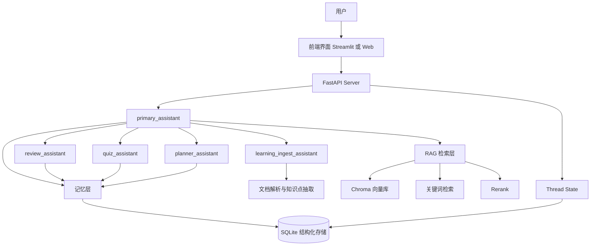
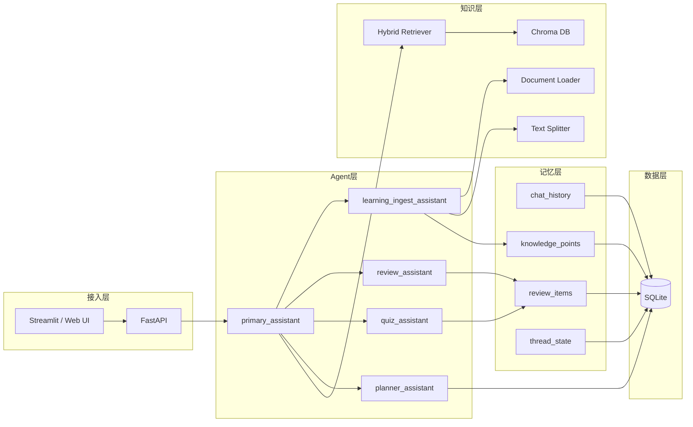
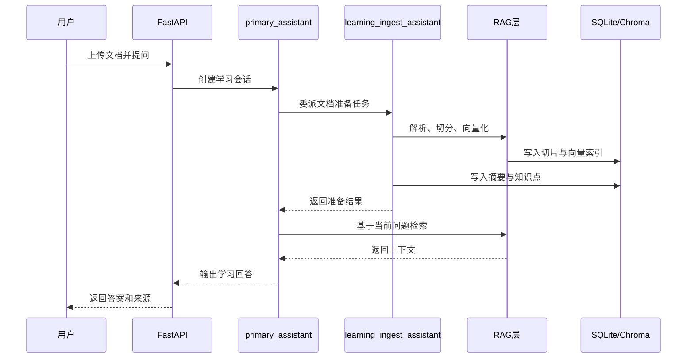
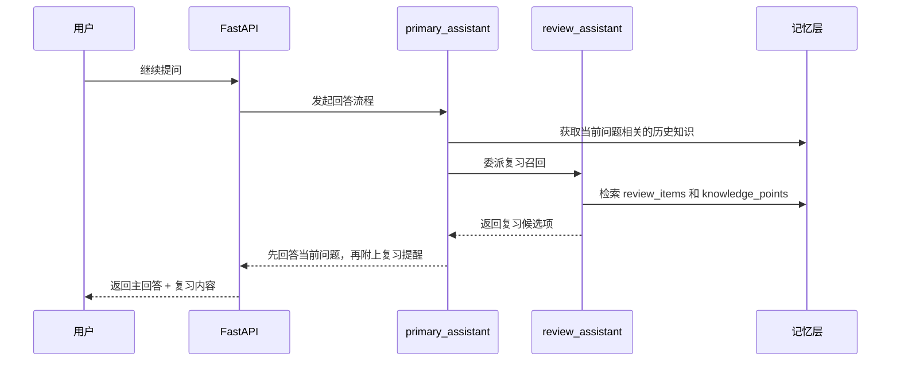
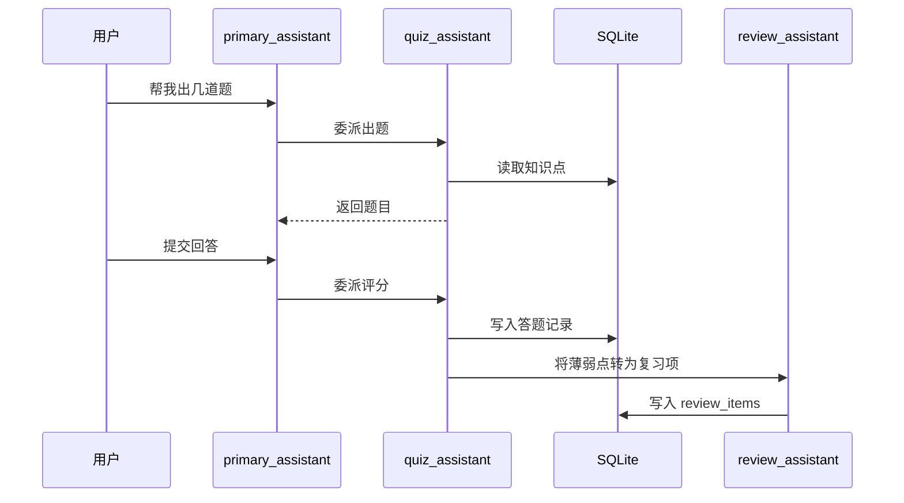

# 学习辅助 Agent 多 Agent 架构图

## 1. 文档目标

本文档用于说明当前学习辅助 Agent 的多 Agent 架构设计、模块边界和核心工作流。

目标不是把 Agent 做得很多，而是把分工、编排和扩展路线讲清楚。

> 当前说明：这份文档更适合作为“多 Agent 设计草图和演进方向”。当前对外稳定主链路仍然是 `/chat` + service 层编排，`agent_engine` 与 `/agent_chat` 属于预留/实验能力，不应直接表述成默认主流程。

## 2. 架构目标

### 2.1 为什么使用多 Agent

使用多 Agent 的原因不是“炫技”，而是为了把不同职责拆开：

1. 主控负责理解意图和调度。
2. 文档处理负责知识准备。
3. 复习负责记忆召回。
4. 测验负责主动回忆。
5. 计划负责目标拆解。

这样做的好处：

1. Prompt 更清晰。
2. 工具边界更明确。
3. 后续更容易扩展和评测。
4. 更适合项目展示和面试讲解。

## 3. 多 Agent 总览

### 3.1 Agent 列表

| Agent | 职责 | 当前状态 |
| --- | --- | --- |
| `primary_assistant` | 总控、意图识别、任务分发、最终回答 | 已有骨架，非当前主链路 |
| `learning_ingest_assistant` | 文档整理、摘要、知识点抽取 | 已有工具与模型定义，非当前主链路 |
| `review_assistant` | 历史知识召回、复习提醒、复习项生成 | 已有工具与模型定义，非当前主链路 |
| `quiz_assistant` | 出题、自测、错题反馈 | 已有工具与模型定义，非当前主链路 |
| `planner_assistant` | 学习计划和优先级调整 | 已有工具与模型定义，非当前主链路 |

## 4. 高层架构图

## 5. 分层架构图

## 6. 核心工作流

### 6.1 工作流一：上传资料并开始学习

### 6.2 工作流二：对话中自动复习

### 6.3 工作流三：测验与错题回流

## 7. Agent 职责边界

### 7.1 `primary_assistant`

负责：

1. 理解用户意图。
2. 选择是否需要子 Agent。
3. 聚合 RAG 结果和复习结果。
4. 生成最终对用户可读的回答。

不负责：

1. 直接承担复杂文档处理。
2. 直接承担长期复习逻辑。
3. 直接承担计划和测验细节。

### 7.2 `learning_ingest_assistant`

负责：

1. 文档准备。
2. 摘要生成。
3. 知识点抽取。
4. 学习材料组织。

### 7.3 `review_assistant`

负责：

1. 复习记忆召回。
2. 轻量复习提示生成。
3. 复习项构建。
4. 薄弱点回流。

### 7.4 `quiz_assistant`

负责：

1. 出题。
2. 自测反馈。
3. 错题提炼。

### 7.5 `planner_assistant`

负责：

1. 今日计划。
2. 学习目标拆解。
3. 优先级调整。

## 8. 为什么当前架构适合第一阶段

1. Agent 数量少，能快速落地。
2. 各 Agent 对应的工具边界清楚。
3. 便于从当前 `stack-based routing` 底座平滑迁移。
4. 非常适合演示“一个总控 + 多个专长 Agent”的工作方式。

## 9. 与当前代码结构的映射

### 9.1 当前已有文件

1. `Zero_RAG/agent_engine.py`
   作为 Agent 编排入口。
2. `Zero_RAG/Server.py`
   作为后端 API 层。
3. `Zero_RAG/chat_history_service.py`
   作为线程状态与对话历史存储层。
4. `tools/learning_ingest_tools.py`
5. `tools/review_tools.py`
6. `tools/quiz_tools.py`
7. `tools/planner_tools.py`

### 9.2 当前更准确的代码现实

1. `services/review_service.py`、`services/document_service.py`、`services/plan_service.py`、`services/quiz_service.py` 已经落地。
2. 学习问答、面试、评测、RAG 评测与质量看板当前主要由 service 层和 `/chat` 主链路驱动。
3. `agent_engine.py` 与 `/agent_chat` 仍然保留，适合作为后续多 Agent 编排演进入口。

## 10. 第二阶段可扩展方向

### 10.1 扩展 Agent

后续如果需要，可以继续扩展：

1. `memory_manager_agent`
2. `evaluation_agent`
3. `interview_agent`

### 10.2 扩展工作流

1. 文档导入工作流。
2. 学习问答工作流。
3. 复习召回工作流。
4. 测验生成与评分工作流。
5. Agent run 评测工作流。

## 11. 总结

第一阶段的架构重点不是“Agent 越多越好”，而是：

1. 分工清晰。
2. 路由可解释。
3. 数据流可追踪。
4. 便于后续加入记忆、评测和执行日志。

这套架构足够支撑 MVP，也足够支撑你后续把项目升级成更完整的 Agent 系统。
